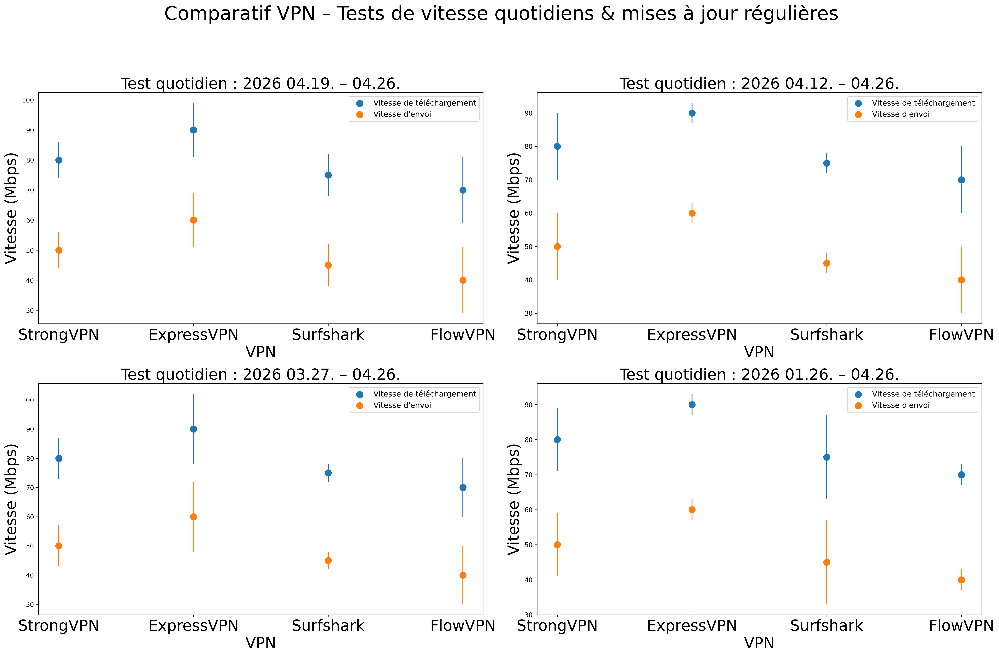
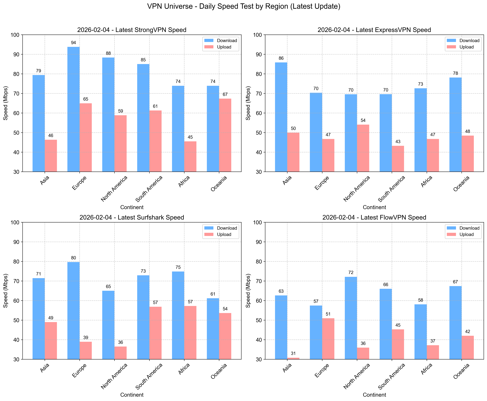
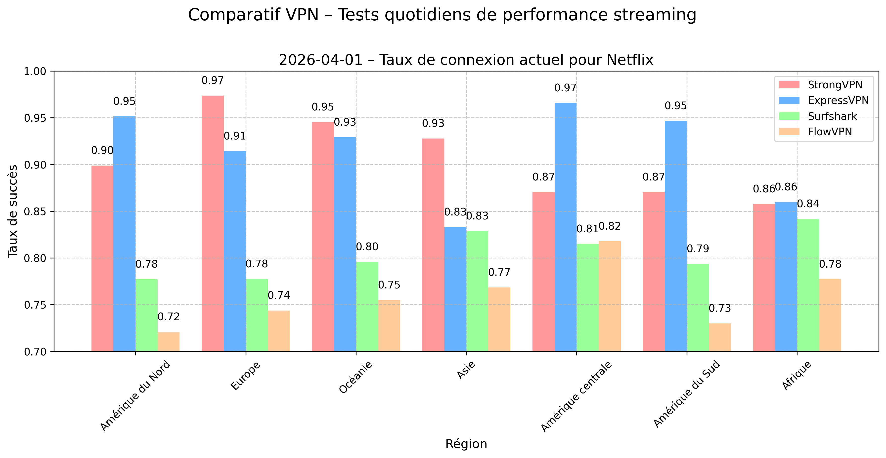

# Meilleurs VPN mondiaux 2026 – Mise à jour quotidienne des vitesses  
**Dernière mise à jour :** 28 février 2026 – VPN Universe


**Dernière mise à jour : 28 février 2026**  
<!--  -->

Si ce guide vous aide, mettez une étoile en haut à droite et abonnez-vous ! Ensemble, construisons un internet plus libre et plus connecté.

### Verdict rapide prix / valeur – Comparatif VPN

### Fonctionnalités clés & Meilleures offres actuelles pour nos 4 VPN favoris

| VPN recommandé | Meilleure offre (Durée)                  | Prix mensuel (USD) | Coût total | Points forts exceptionnels                | Paiement international ? |
|----------------|------------------------------------------|--------------------|------------|-------------------------------------------|--------------------------|
| [StrongVPN](https://strongvpn.com/fr/?tr_aid=60d96b5810e50&chan=w_github_fr&data1=fanqiang&data2=title) | Plan 1 an                               | ~3,97–4,50 $      | ~47–54 $  | Meilleur rapport qualité-prix du moment   | Oui                      |
| [FlowVPN (Essai gratuit 2 jours)](https://www.flowvpx.com/sign-up/?locale=fr&special=FREETRIAL&r=35-890485.w_github) | Plan 1 an                               | ~4,17 $           | ~50 $     | Essai sans risque de 2 jours              | Oui                      |
| [ExpressVPN (12 mois + mois gratuits bonus)](https://go.expressvpn.com/c/3828265/1634752/16063) | 12 mois + bonus (jusqu’à 15–16 mois)   | ~5,33–6,67 $      | ~80 $     | Stabilité et vitesse premium              | Non (mais très accepté)  |
| [Surfshark](https://surfy-chinaz.com/fr/deals?coupon=surfsharkdeal&transaction_id=102bf6a775238fcbd88327845dfa5b&offer_id=323&affiliate_id=5585&utm_source=Affiliates&utm_medium=5585&utm_campaign=affiliate&recurring_goal_id=312) | Plan 2 ans                              | ~1,99–2,30 $      | ~53–55 $  | Connexions illimitées sur tous vos appareils | Non (mais très accepté)  |

### Graphique comparatif des prix – Les achats les plus malins en ce moment

- Vous visez **1 an** et pas besoin de vitesse ultra-rapide ? Optez pour **[StrongVPN](https://strongvpn.com/fr/?tr_aid=60d96b5810e50&chan=w_github_fr&data1=fanqiang&data2=title)** à environ 47–54 $ au total (réduction fraîche à chaque renouvellement via nouvel email) → ~4 $/mois.
- Budget serré sur **2 ans** ? **[Surfshark](https://surfy-chinaz.com/fr/deals?coupon=surfsharkdeal&transaction_id=102bf6a775238fcbd88327845dfa5b&offer_id=323&affiliate_id=5585&utm_source=Affiliates&utm_medium=5585&utm_campaign=affiliate&recurring_goal_id=312)** offre un rapport qualité-prix dingue à ~53–55 $ au total → souvent moins de 2 $/mois.
- Vous voulez la **vitesse premium et une fiabilité à toute épreuve** sur 1 an ? **[ExpressVPN](https://go.expressvpn.com/c/3828265/1634752/16063)** (avec mois gratuits en plus) vaut les ~6 $/mois en moyenne.
- Besoin juste d’un accès basique (lire des articles scientifiques, navigation légère) ? Testez **[FlowVPN](https://www.flowvpx.com/sign-up/?locale=fr&special=FREETRIAL&r=35-890485.w_github)** avec son essai gratuit généreux.

Après des semaines de tests réels dans plusieurs régions (dont Europe, Asie, Amérique), voici le classement des vitesses. **ExpressVPN** domine en stabilité et faible variation, **StrongVPN** surpasse largement son prix, tandis que **Surfshark** et **FlowVPN** sont d’excellents choix milieu de gamme. Choisissez selon votre budget vs vos besoins en vitesse.

Nous effectuons des **tests de vitesse quotidiens frais** (moyennes sur 7, 14, 30 et 90 derniers jours), avec 10–20 connexions par jour pour plus de fiabilité. Détails complets de la méthodologie en bas de page. Les lignes horizontales indiquent l’écart-type (variabilité).

#### Résultats tests de vitesse VPN – Download & Upload (moyennes quotidiennes fraîches)

Voici nos derniers résultats combinés depuis les régions les plus courantes :


| Service VPN   | WireGuard / Protocole propriétaire | OpenVPN   |
|---------------|------------------------------------|-----------|
| ExpressVPN    | 600 Mbps                          | 400 Mbps  |
| FlowVPN       | 650 Mbps                          | 380 Mbps  |
| StrongVPN     | 500 Mbps                          | 350 Mbps  |
| Surfshark     | 800 Mbps                          | 300 Mbps  |

**Recommandations rapides selon prix + vitesse**  
- Plan 1 an pas cher avec vitesse correcte ? **[StrongVPN](https://strongvpn.com/fr/?tr_aid=60d96b5810e50&chan=w_github_fr&data1=fanqiang&data2=title)** — environ 43 $ au total (réduction fraîche via nouvel email) → ~4 $/mois.  
- Vitesse premium et performances béton sur 1 an ? **[ExpressVPN (12 mois + mois gratuits bonus)](https://go.expressvpn.com/c/3828265/1634752/16063)** — environ 6 $/mois après réduction (nouvel email à chaque renouvellement).

La vitesse, c’est primordial avec un VPN. Si ça rame, vous l’abandonnerez vite… et adieu la protection de votre vie privée. Aujourd’hui, la plupart des gens veulent du streaming HD/4K fluide sans buffering, du jeu en ligne sans lag (EA FC, etc.), et une navigation sereine.

Nous testons chaque service sur une vraie ligne 1 Gbps avec Ookla Speedtest, nPerf, Netflix Fast et outils CLI. Nous prenons la médiane de tous les outils pour des résultats réalistes, et nous lançons les tests matin et soir tous les jours.


<!-- NEWS-START -->
<!-- ### 📰 Industry Context (January 21, 2026)

- [Trump doubles down on Greenland ahead of Davos visit, saying there is 'no going back'](https://www.bbc.com/news/articles/cvgr19m642zo?at_medium=RSS&at_campaign=rss)
- [Lyse Doucet: Trump is shaking the world order more than any president since WW2](https://www.bbc.com/news/articles/cx2lej7d52po?at_medium=RSS&at_campaign=rss)
- [Driver killed in second deadly Spain train crash in days](https://www.bbc.com/news/articles/c1m78xl0gmpo?at_medium=RSS&at_campaign=rss)
- [Locked exits, panic and desperate calls for help: Survivors tell of mall fire horror](https://www.bbc.com/news/articles/c1ev4z4n5dzo?at_medium=RSS&at_campaign=rss) -->

<!-- NEWS-END -->


## Navigation du contenu

### 1. [Les bases de l’accès internet libre & sans restriction](#basics-of-unrestricted-access)
### 2. [Fonctionnalités clés des meilleurs VPN mondiaux – Résumé](#key-features-of-recommended-global-vpns)
#### 2.1 [StrongVPN – Meilleur rapport qualité-prix](#strongvpn-recommendation)
#### 2.2 [ExpressVPN – 12 mois + 3 mois gratuits](#expressvpn-12-months-+-3-months-free)
#### 2.3 [Surfshark – Connexions illimitées sur tous vos appareils](#surfshark-unlimited-connections)
#### 2.4 [FlowVPN – Essai gratuit 2 jours](#flowvpn-2-day-free-trial)
#### 2.5 [Analyse & Comparaison des politiques de confidentialité des top VPN](#privacy-policy-comparison-vpn-providers)
### 3. [StrongVPN – Guide pas à pas avec paiements internationaux](#strongvpn-international-payment-tutorial)
#### 3.1 [Guide pas à pas : Installer StrongVPN sur mobile (Android & iOS)](#tutorial-de-configuracion-de-strongvpn-en-androidios)
### 4. [Guide achat ExpressVPN – Profitez de la meilleure offre](#expressvpn-purchase-tutorial)
#### 4.1 [Guide configuration ExpressVPN – PC, mobile & tablette](#expressvpn-setup-tutorial)
### 5. [Surfshark – Guide achat rapide (offre connexions illimitées)](#surfshark-purchase-tutorial)
### 6. [FlowVPN – Essai gratuit 2 jours & Guide achat](#flowvpn-purchase-and-free-trial-tutorial)
### 7. [VPN à éviter – Liste des providers non recommandés (mise à jour 2026)](#vpn-avoid-list)
### 8. [Critères de recommandation VPN & Fonctionnalités indispensables](#vpn-recommendation-standards-and-essential-features)
### 9. [Connaissances VPN essentielles que tout le monde devrait comprendre](#essential-vpn-knowledge-you-need-to-know)
#### 9.1 [VPN double ou multi-sauts – Comment et pourquoi les utiliser](#double-multi-hop-vpn-uses-benefits)
#### 9.2 [Impact des VPN sur la vitesse internet – La vraie parole](#vpn-impact-on-network-speed)
#### 9.3 [Différences entre « logiciels d’accès » et vrais VPN](#differences-between-access-software-and-vpns)
#### 9.4 [Pourquoi et comment changer de provider VPN régulièrement pour plus de sécurité](#how-to-rotate-vpn-providers-for-better-security)
### 10. [Introduction à la cryptographie de base & Principes VPN](#introduction-to-basic-cryptography-and-vpn-principles)
### 11. [Ce que vous pouvez faire avec un VPN + Précautions importantes](#what-you-can-do-with-a-vpn-and-precautions)
### 12. [Introduction aux protocoles VPN courants & Outils](#introduction-to-common-vpn-protocols)
#### 12.1 [Différences & Cas d’usage : VPN vs Tor](#differences-and-use-cases-vpn-vs-tor)
#### 12.2 [VPN vs Serveurs Proxy – Différences clés](#differences-between-vpn-and-proxy-servers)
### 13. [Analyse des serveurs VPN – Astuces pratiques & infos utiles](#vpn-server-analysis-practical-tips)
#### 13.1 [Comment réparer les déconnexions et interruptions VPN](#how-to-fix-vpn-connection-drops)
#### 13.2 [Comment garder votre VPN toujours actif et fiable](#how-to-keep-vpn-always-active)
### 14. [Pourquoi on déconseille les VPN gratuits – Les vrais risques](#risks-of-free-vpns-why-we-dont-recommend-them)
### 15. [Pourquoi construire son propre VPN n’est pas recommandé](#why-not-build-your-own-vpn)
### 16. [Meilleures fonctionnalités VPN pour le gaming – Montez de niveau](#vpn-features-for-gaming)
### 17. [Guide pas à pas : Regarder du contenu streaming mondial avec un VPN](#guide-to-streaming-with-vpn)
#### 17.1 [Comment Netflix & Hulu détectent et bloquent les VPN](#how-netflix-and-hulu-detect-and-block-vpns)
### 18. [Rapport détaillé tests vitesse VPN (mise à jour quotidienne fraîche – 12 janvier 2026)](#detailed-vpn-speed-test-report)
#### 18.1 [Taux de succès connexion par continent](#vpn-connection-success-rates-by-continent)
#### 18.2 [Tests vitesse VPN par régions mondiales](#vpn-speed-tests-global-regions)
#### 18.3 [Taux de succès connexion Netflix par continent](#netflix-connection-success-rates-by-continent)
#### 18.4 [Taux de succès connexion Disney+ par continent](#disney-plus-connection-success-rates-by-continent)
### 19. [Tutoriel installation VPN sur Linux](#vpn-installation-tutorial-on-linux)
### 20. [Apps & Services qui peuvent bloquer ou restreindre les VPN](#apps-and-services-that-may-block-vpns)
### 21. [BitTorrent avec VPN – Setup & Meilleures pratiques](#bittorrent-with-vpn-setup-tips)
### 22. [FlowVPN pour Apple TV – Pourquoi il se distingue](#vpn-for-apple-tv)
### 23. [Tendances VPN & Prédictions futures (2026 et au-delà)](#vpn-trends-and-future-predictions)
#### 23.1 [Limitations courantes VPN & Comment les résoudre](#vpn-limitations-and-solutions)


**Dans le monde d'aujourd'hui**, les VPN vraiment stables et efficaces à l'échelle mondiale deviennent de plus en plus rares. Beaucoup de sites de reviews se contentent de copier le contenu des autres, perdant rapidement toute pertinence. Certains VPN recommandés marchent mal (ou pas du tout) dans certaines régions, et malheureusement, de nombreux testeurs ne vérifient pas depuis ces endroits avec une vraie expérience locale. Ces dernières années, le durcissement des restrictions réseau a rendu beaucoup de services autrefois fiables quasiment inutilisables. Lisez cet article attentivement pour éviter les pièges classiques. Ce guide repose sur mon expérience réelle et est mis à jour quotidiennement pour vous aider à choisir des outils sûrs et fonctionnels pour le streaming, le gaming et la protection de votre vie privée. Pour une reco rapide, sautez directement à la section des suggestions en bas.

Le besoin de contourner les restrictions pour un accès internet libre et ouvert n’a jamais été aussi évident. Sans cela, impossible de chercher du code sur Google, de répondre sur Gmail, de regarder des vidéos YouTube, de suivre des cours Udemy, de binge-watcher des séries HBO ou Netflix, ou de lire les news de BBC et CNN. Voyageant souvent pour le travail et les études, je dépends de ces outils dans différentes régions. En tant que programmeur et docteur en machine learning avec une solide expertise en réseaux, je vous guide en détail sur les VPN, la sécurité, les technos comme WireGuard et V2Ray, et je partage mes vrais tests de vitesse pour vous aider à choisir les options les plus stables et sécurisées.

Les rapports mondiaux montrent que le nombre d’utilisateurs en ligne a explosé au-delà des 900 millions, rendant l’accès sans restriction plus crucial que jamais. Beaucoup de blogs recommandent des VPN sans vraie vérification, en poussant des services inefficaces voire risqués. Certains sites se contentent de mots buzz vides, et avec les blocages qui se durcissent à chaque mise à jour, pas mal de VPN deviennent totalement inutilisables. C’est pour ça que j’ai créé ce guide basé sur GitHub — pour vous aider à éviter les arnaques, les pertes de temps et les outils dangereux. Cet article rentre dans les détails techniques ; si vous voulez juste une reco rapide, allez voir les suggestions rapides à la fin.

Des années de travail et de vie dans différents pays m’ont montré que contourner les restrictions est devenu une compétence essentielle. Sans ça, impossible d’apprendre sur Google, de regarder YouTube, de chatter avec les amis sur Facebook ou Line, de suivre des cours Coursera/Udemy, ou de profiter du divertissement HBO, Netflix, BBC, CNN. En tant que pro itinérant et docteur en machine learning spécialisé réseaux, je vous livre un guide détaillé basé sur l’expérience : VPN, sécurité, WireGuard, V2Ray et plus — avec mes tests de vitesse et usage réel — pour choisir les outils les plus fiables et sécurisés.

## Actualités récentes sur les VPN

Une mise à jour de sécurité Microsoft récente a causé des problèmes de connexion VPN pour de nombreux utilisateurs Windows 11, 10 et Server. Plusieurs rapports sur Reddit mentionnent des échecs après le patch, souvent résolus temporairement en réinstallant l’app VPN. Microsoft a reconnu le souci et promis une correction future.

## État actuel des VPN

Depuis fin 2021 jusqu’à récemment, le paysage VPN a beaucoup changé. Des services comme Ivacy, VyprVPN et d’autres ont subi des blocages fréquents de serveurs dans plusieurs régions, avec des failles de sécurité exposées au grand jour. On déconseille fortement de prendre ces risques. Même des gros joueurs comme NordVPN ont pris des coups et nécessitent souvent des configs manuelles maintenant, tandis que PIA — autrefois en pleine montée — a perdu de sa superbe et reste déconnecté dans de nombreuses zones.

PandaVPN est injoignable depuis plusieurs mois, site HS et support muet — probablement abandonné. Beaucoup d’autres services ont suivi le même chemin, restez vigilants.

Cependant, comme une étoile polaire, **ExpressVPN** et **StrongVPN** restent ultra-stables. ExpressVPN est comme un couteau suisse : fonctionne impeccablement sur toutes les plateformes et récupère généralement en moins d’une semaine grâce à des mises à jour rapides. StrongVPN est notre « soldat léger » fiable — excellent rapport qualité-prix, apps universelles et simplifiées pour Windows, Mac, Android, avec des serveurs rafraîchis régulièrement et peu de blocages. Sur iPhone, il peut falloir un setup manuel en période sensible, mais leur équipe fournit souvent des configs alternatives quand besoin.

Ce site inclut des guides détaillés, des tests de vitesse frais et des solutions aux problèmes courants. Utilisez la navigation en bas pour sauter directement à la section qui vous intéresse.

<a name="basics-of-unrestricted-access"></a>
## Les bases de l’accès internet libre & sans restriction

<a name="what-is-free-browsing"></a>
### C’est quoi l’« accès internet libre » (navigation sans restriction) ?

Commençons par les fondamentaux des restrictions réseau.

#### Qu’est-ce que les restrictions réseau ? (Les bases)

Les politiques de contrôle réseau sont des mesures globales mises en place par les autorités pour protéger les entreprises et infrastructures critiques contre les cyberattaques. Elles bloquent l’accès à certains sites et services. Parmi les plateformes couramment censurées : Facebook, YouTube, Instagram, Vimeo, Spotify, Snapchat, Tumblr, ainsi que les grands médias occidentaux comme The New York Times, CNN, Reuters, The Wall Street Journal.  
Quand on essaie d’y accéder, on tombe souvent sur des erreurs techniques (404 Not Found, connexion reset, timeout, etc.), causées par du DNS poisoning, blocage IP, filtrage URL, inspection profonde des paquets (DPI) et resets TCP forcés. Parfois, une surveillance par mots-clés traque aussi l’activité.

#### Pourquoi contourner ces restrictions ?

C’est simple : sans moyen de passer outre, le télétravail, les communications et la vie en ligne deviennent très compliqués. Des outils essentiels comme Slack, Microsoft OneDrive, Dropbox sont souvent inaccessibles. Toute la suite Google (Gmail, Google Drive, etc.) est bloquée aussi. Les réseaux sociaux — Facebook, YouTube, Instagram, Vimeo, Spotify, Snapchat, Tumblr — rendent difficile le contact avec amis et famille.  
La plupart des grands médias occidentaux (The New York Times, CNN, Reuters, Financial Times et bien d’autres) sont restreints, et la liste évolue constamment.

#### Comment les VPN permettent un accès libre

Un VPN (Virtual Private Network) aide à contourner la censure internet en faisant croire à votre FAI que vous vous connectez depuis un autre pays ou région. Bien que l’usage de VPN soit techniquement restreint ou illégal dans certains endroits, les poursuites contre les voyageurs, expats ou pros sont extrêmement rares.  
Astuce pro : Téléchargez et configurez toujours votre **VPN avant** d’entrer dans une zone restreinte — beaucoup de sites de fournisseurs VPN sont bloqués sur place. On recommande vivement des providers testés au feu comme ExpressVPN et StrongVPN, qui ont prouvé leur fiabilité même face aux restrictions les plus dures. Les gens parlent souvent de ces outils avec des termes neutres comme « aides à la navigation libre » ou « outils d’accès » pour rester discret.

En résumé, le processus d’utilisation de logiciels spécialisés pour accéder librement aux sites internationaux s’appelle couramment « navigation libre » ou « accès internet sans restriction », et les outils principaux sont les VPN et solutions similaires de confidentialité/accès.

#### Un autre gros avantage des VPN : masquer votre vraie adresse IP

Votre adresse IP, c’est en gros votre « adresse postale » sur internet — elle révèle votre localisation approximative et peut vous identifier de façon unique. C’est pratique pour certaines choses… mais c’est aussi un énorme risque pour la vie privée, car les tiers (FAI, annonceurs, hackers) peuvent surveiller et tracker tout ce que vous faites en ligne via elle.  
Un VPN remplace instantanément votre IP réelle par celle de son serveur, chiffre toute votre connexion et cache votre identité en quelques secondes. Ça crée un tunnel privé sécurisé pour tout votre trafic, protégé des regards indiscrets.

#### Avantage supplémentaire : Wi-Fi public sécurisé (cafés, aéroports, hôtels)

Le Wi-Fi public est partout — cafés, aéroports, hôtels — et super pratique. Mais sans protection, c’est hyper dangereux. Les hackers sur le même réseau peuvent facilement espionner vos données non chiffrées : identifiants, infos bancaires, mails pro, numéros de téléphone, messages — tout y passe.  
Un bon VPN chiffre votre connexion de bout en bout, donc même sur les hotspots les plus louches, vos données restent privées et sécurisées.


### Protocoles courants utilisés dans les outils de navigation libre

Ensuite, voici quelques termes techniques clés que vous croiserez souvent dans l’univers des VPN. Les connaître vous aidera à mieux comprendre les différences et à faire des choix plus éclairés quand vous sélectionnez un fournisseur.

**VPN**  
Si vous avez déjà l’habitude de contourner les restrictions, vous avez sûrement entendu parler des VPN. Un VPN est un outil de chiffrement qui masque votre vraie adresse IP, votre localisation et vos données personnelles. Imaginez que vous mettez un déguisement parfait — c’est surtout le chiffrement qui compte — ce qui vous permet d’accéder à du contenu bloqué sans être tracé.  
Beaucoup ont commencé à utiliser les VPN pour une sécurité basique (surtout les télétravailleurs pendant la pandémie), mais les anciennes méthodes traditionnelles sont devenues moins efficaces face aux restrictions modernes et avancées. Aujourd’hui, il faut des solutions plus robustes et à jour.

<a name="key-features-of-recommended-global-vpns"></a>
## Fonctionnalités clés des meilleurs VPN mondiaux – Résumé

Après avoir testé des centaines de VPN au fil des années, voici mes recommandations principales basées sur mon expérience réelle en business international, voyages fréquents et expertise approfondie en réseaux. Consultez les rapports de tests de vitesse frais plus bas pour les comparaisons détaillées. Comme quelqu’un qui utilise ces outils tous les jours, je ne recommande que les services qui offrent ces fonctionnalités essentielles :

- Sécurité de haut niveau (fournisseurs basés hors zones restreintes, idéalement dans des juridictions no-logs)
- Stabilité de connexion à toute épreuve
- Vitesse maximale possible
- Grand réseau de serveurs (accès à de nombreux pays/régions)
- Ultra-simple d’utilisation (connexion en un clic)
- Chiffrement avancé & fonctionnalités de confidentialité
- Support multi-appareils simultanés
- Large compatibilité (Windows, macOS, Linux, Android, iOS, routeurs, etc.)
- Support client 24/7 en plusieurs langues
- Garantie satisfait ou remboursé 30 jours
- Options de paiement flexibles (y compris méthodes internationales)
- Prix juste avec un excellent rapport qualité-prix

<a name="strongvpn-recommendation"></a>
### 1. [StrongVPN – Meilleur rapport qualité-prix](https://strongvpn.com/fr/?tr_aid=60d96b5810e50&chan=w_github_fr&data1=fanqiang&data2=title)


**StrongVPN** est un VPN en pleine ascension avec des serveurs en Europe et aux Amériques, à des prix bien plus bas que les grosses marques comme ExpressVPN — environ 3,50–4 $/mois sur le plan 12 mois (total ~43–54 $). Contrairement à certains premiums, il accepte pleinement les paiements internationaux, et leur équipe technique rafraîchit régulièrement les serveurs pour devancer les blocages.

Parfait pour un usage quotidien : streamer YouTube, scroller Facebook, débloquer Netflix, Hulu, ABC, HBO, Sky Go et bien plus. Ils proposent des apps natives propres pour Windows, macOS, iOS, Android et Amazon Fire TV, plus des guides faciles pour Chrome, routeurs, Fire TV Stick et Kodi.

Avec plus de 950 serveurs compatibles P2P dans 35+ pays et 46 villes, StrongVPN supporte les protocoles modernes : L2TP, SSTP, OpenVPN, IKEv2 et surtout le très rapide WireGuard. Vous avez le support live chat & email 24/7 + garantie remboursement 30 jours complète. Pas de gadgets inutiles — juste des performances fiables qui font le job pour la plupart des utilisateurs.

**StrongVPN** gère un réseau vraiment global : 950+ serveurs, 30+ pays, 46 villes et plus de 59 500 IP VPN uniques. Ils appliquent une politique no-logs stricte — pas de traçage ni de vente de vos données à des tiers. Leur seul but : vous garder sécurisé et privé.

#### Quelle est la vraie vitesse de StrongVPN ?

La vitesse compte autant que la confidentialité. Nous avons testé StrongVPN sur de vraies lignes 1 Gbps (serveurs US & UK) avec SpeedTest, SpeedOf.me, nPerf et plus.  
- OpenVPN : 230–240 Mbps (US) — largement suffisant pour du streaming HD/4K  
- IKEv2 : 260–280 Mbps — très proche des niveaux premium  
- WireGuard : 270–300 Mbps (US), jusqu’à 450 Mbps (UK) — dans des tests antérieurs on a même dépassé 600 Mbps  

Sur une connexion domestique classique (100–500 Mbps), la différence avec les VPN les plus rapides (800+ Mbps) est à peine perceptible. StrongVPN offre d’excellentes performances réelles.

**12 connexions simultanées** : Utilisez StrongVPN sur jusqu’à 12 appareils en même temps — idéal pour les familles ou plusieurs gadgets.

### Fonctionnalités clés StrongVPN

- Large compatibilité : Apps pour iOS, Android, macOS, Windows + guides Linux & routeurs
- Jusqu’à 12 connexions simultanées
- Débloque fiablement Netflix, Amazon Prime Video, Disney+, Hulu et plus
- Inclut 250 Go de stockage cloud SugarSync (bonus plan annuel)
- 950+ serveurs dans le monde
- Protocoles : WireGuard, OpenVPN, IKEv2, L2TP/IPsec, SSTP
- Garantie 30 jours satisfait ou remboursé
- Support live chat & email 24/7 par des experts
- Politique de confidentialité no-logs stricte — pas de traçage, pas de stockage de données
- Bien moins cher qu’ExpressVPN ou Surfshark sur le long terme
- Accepte les paiements internationaux (cartes, PayPal, etc.)
- Stabilité de connexion exceptionnelle

| Fonctionnalité / Spécification   | StrongVPN                                  |
|----------------------------------|--------------------------------------------|
| Plateformes clientes             | Windows, macOS, Linux, Android, iOS, DD-WRT, GL.iNet routeurs, Android TV |
| Protocoles supportés             | OpenVPN, L2TP/IPsec, SSTP, WireGuard       |
| Nombre de serveurs               | 950+                                       |
| Nombre de pays                   | 35+                                        |
| Juridiction / Basé à             | États-Unis                                 |
| Modes de paiement                | Cartes bancaires, PayPal, options internationales |
| Vérification ID requise ?        | Non                                        |
| Protocoles de chiffrement        | WireGuard, OpenVPN, IKEv2, L2TP, SSTP      |
| Données / Bande passante         | Illimité                                   |
| Limites d’usage                  | Illimité                                   |
| Appareils connectés simultanés   | 12                                         |
| Support client                   | Email, live chat 24/7, téléphone           |
| Politique de confidentialité     | No-logs (stricte)                          |

<a name="expressvpn-12-months-+-3-months-free"></a>
### 2. [ExpressVPN – 12 mois + 3 mois gratuits](https://www.expressvpn.com/top/homepage?xvcid=yKMwqFWTfxyKWsB3AWwmhXdXUkpTX-RFKSOyxU0&shareid=&irclickid=yKMwqFWTfxyKWsB3AWwmhXdXUkpTX-RFKSOyxU0&irgwc=1&afsrc=1)


ExpressVPN est largement considéré comme la référence absolue sur le marché des VPN — et à juste titre. Il propose un package complet, professionnel, qui surpasse la plupart des concurrents en fiabilité, vitesse et capacité de déblocage.

Il offre des apps natives de très haut niveau pour Windows, macOS, Android, iOS, Linux et plus, avec des guides détaillés pour routeurs, Apple TV, Fire TV, PlayStation, Chromebook, Kindle et même les smart TV. Les fonctionnalités sécurité incluent des serveurs DNS privés (aucune fuite tiers), chiffrement militaire AES-256-GCM, perfect forward secrecy via Diffie-Hellman, authentification HMAC anti-tampering, et un kill switch béton qui coupe internet si le VPN tombe — votre vraie IP reste cachée en permanence.

Avec **plus de 3 000 serveurs dans 94 pays et 160+ localisations**, ExpressVPN offre une couverture mondiale inégalée — particulièrement forte en Europe, aux US et en Asie (27 pays rien qu’en Asie), loin devant les petits comme Mozilla VPN (~30 pays seulement). Parmi les plus gros et mieux dotés en ressources, ils mettent à jour les serveurs ultra-rapidement, débloquent fiablement Netflix (plusieurs catalogues), supportent le P2P/torrent, et maintiennent une politique no-logs stricte et auditée. La stabilité de connexion est parmi les meilleures du secteur — parfait pour du streaming 4K, du gaming sans lag et du télétravail intensif.

Le seul vrai inconvénient ? Son prix premium — mais les performances le justifient pour qui veut le meilleur absolu.

#### Fonctionnalités clés ExpressVPN

- Plus de 3 000 serveurs dans 160+ localisations et 94 pays
- Base d’utilisateurs énorme et active → mises à jour rapides et fiabilité
- Rafraîchissement automatique et fréquent des serveurs
- Garantie 30 jours satisfait ou remboursé
- **Support live chat 24/7** (de vrais humains, pas des bots)
- Apps natives pour Windows, macOS, iOS, Android, Linux + routeurs, consoles, smart TV et plus
- Accepte plusieurs devises, dont Bitcoin
- Chiffrement leader du marché (AES-256-GCM, protocole Lightway)

**Offre exclusive** : Inscrivez-vous via notre lien et obtenez **3 mois gratuits supplémentaires** sur le plan annuel (15 mois au total, soit ~6,67 $/mois en moyenne). Ils acceptent cartes bancaires, PayPal, Bitcoin et plus.  
Astuce pro : Téléchargez l’app sur Android ou iOS d’abord pour un **essai gratuit 7 jours** (pas de carte requise dans certaines régions). Combinez ça avec la garantie 30 jours complète, et vous testez ExpressVPN totalement sans risque. Annulation simple — pas de questions, remboursement intégral si ça ne vous convient pas.

| Fonctionnalité                   | ExpressVPN                                             |
|----------------------------------|--------------------------------------------------------|
| Nombre de serveurs               | 3 000+                                                 |
| Nombre de pays                   | 94                                                     |
| Plateformes supportées           | Windows, macOS, iOS, Android, Linux, BlackBerry, Kindle Fire, Nook, routeurs, consoles de jeux (via MediaStreamer), Amazon Fire TV, Apple TV, Chromebook, Windows Phone |
| Connexions simultanées           | 5                                                      |
| Split Tunneling                  | Oui                                                    |
| Kill Switch                      | Oui (Network Lock)                                     |
| Protocoles supportés             | Lightway, OpenVPN UDP, OpenVPN TCP, L2TP/IPSec, IKEv2  |
| Juridiction / Basé à             | Îles Vierges britanniques (favorable à la confidentialité) |
| Support client                   | Live chat 24/7, email, base de connaissances complète  |


<a name="surfshark-unlimited-connections"></a>
### 3. [Surfshark – Connexions illimitées sur tous vos appareils](https://surfy-chinaz.com/fr/deals?coupon=surfsharkdeal&transaction_id=102bf6a775238fcbd88327845dfa5b&offer_id=323&affiliate_id=5585&utm_source=Affiliates&utm_medium=5585&utm_campaign=affiliate&recurring_goal_id=312)


**Surfshark** est un VPN puissant et bourré de fonctionnalités qui surpasse largement son prix — performances premium à l’un des tarifs les plus bas du marché. Même si son kill switch peut avoir de petits bugs occasionnels et que les vitesses OpenVPN ne sont pas les plus folles, vous ne trouverez nulle part un meilleur rapport qualité-prix. Lancé en 2018, Surfshark est devenu un favori du public et rivalise aujourd’hui avec les plus grands.

Il gère **plus de 4 500 serveurs dans 100 pays et plus de 140 localisations**, pour une couverture quasi-universelle et des performances fiables presque partout. Apps intuitives et propres pour Windows, macOS, iOS, Android, Linux, plus extensions pour Chrome, Firefox et Edge. Ils incluent aussi Smart DNS pour configurer facilement consoles, smart TV et autres appareils.

Sécurité au top : chiffrement AES-256-GCM, support WireGuard (ultra-rapide), OpenVPN, IKEv2, politique no-logs stricte (auditée indépendamment plusieurs fois), kill switch pour protéger en cas de coupure. Comme ExpressVPN, il est basé aux Pays-Bas (juridiction très favorable à la confidentialité, GDPR, hors alliances de surveillance). Pas de logs d’activité, juste email et infos de paiement.

Surfshark excelle au déblocage : Netflix dans ~20 catalogues (US, UK, Japon, France, Italie, Australie, etc.), Amazon Prime Video, Disney+, Hulu et plus. Idéal pour du streaming intensif, torrenting et gaming en ligne.

#### Fonctionnalités clés Surfshark

- Prix d’entrée incroyablement bas
- Audits de sécurité indépendants récents pour plus de sérénité
- Performances streaming exceptionnelles
- Paiements flexibles : cartes bancaires, PayPal, crypto, Amazon Pay, Google Pay
- Support client 24/7 efficace
- Plus de 4 500 serveurs dans 100 pays avec connexions simultanées illimitées
- **Appareils illimités** — protégez toute la famille (téléphones, ordis, TV, etc.)
- Garantie 30 jours satisfait ou remboursé
- Prix le plus bas vu : ~2,30 $/mois sur le plan 2 ans
- Surfshark Nexus (fonctionnalités avancées : Rotating IP pour changer d’IP toutes les quelques minutes sans déconnexion, plus d’outils ajoutés régulièrement)

<a name="flowvpn-2-day-free-trial"></a>
### 4. [FlowVPN – Essai gratuit 2 jours](https://www.flowvpx.com/sign-up/?locale=fr&special=FREETRIAL&r=35-890485.w_github)


**FlowVPN** se distingue par son **essai gratuit 2 jours complet** (pas de carte requise dans la plupart des cas) — parfait pour tout tester sans risque avant de s’engager. C’est un choix pratique et économique, très apprécié des étudiants, utilisateurs légers et ceux qui veulent de solides performances sans se ruiner.

FlowVPN offre des vitesses et une stabilité compétitives, souvent au niveau ou au-dessus de nombreux providers européens/américains (voir l’image de test de vitesse ci-dessus pour les résultats réels). Ils acceptent les paiements internationaux et proposent un support multilingue.

#### Fonctionnalités clés FlowVPN

- **Essai gratuit 2 jours incroyable** — testez sans risque, zéro engagement
- Plans long terme abordables, parfaits pour étudiants et usage quotidien
- Bonne stabilité et vitesses (vérifiez les tests frais)
- Options de paiement internationales + support multilingue
- Large choix de protocoles : IPSec IKEv1/IKEv2, WireGuard, OpenVPN, L2TP, PPTP, SSL custom et FlowTCP
- Plus de 100 serveurs dans 70+ pays (forte couverture UK, US, Australie, etc.)
- Apps natives pour Windows, macOS, iOS, iPad, Android
- Jusqu’à **10 connexions simultanées** (mise à jour récente)
- Réductions spéciales étudiants et enseignants

### Analyse & Comparaison des politiques de confidentialité des top VPN
<a name="privacy-policy-comparison-vpn-providers"></a>

Quand on choisit un VPN, la **politique de confidentialité** est l’un des points les plus cruciaux pour protéger vos données et votre identité réelle. Voici un comparatif clair côte à côte d’ExpressVPN, StrongVPN et Surfshark — les trois les plus recommandés dans ce guide.

#### ExpressVPN
Basé aux Îles Vierges britanniques (juridiction pro-confidentialité sans lois de rétention obligatoire), ExpressVPN applique l’une des politiques **no-logs** les plus strictes du secteur. Audits indépendants confirment : pas d’enregistrement de votre navigation, timestamps de connexion, IP, requêtes DNS.

#### StrongVPN
Basé aux États-Unis. Ils s’engagent aussi sur une politique **no-logs** pour l’activité et le trafic utilisateur. La juridiction US peut inquiéter à cause des potentielles demandes de données, mais StrongVPN affirme ne pas stocker de logs identifiants et ne se plie qu’aux ordres légaux valides (jamais problématique pour leurs utilisateurs en pratique).

#### Surfshark
Comme ExpressVPN, Surfshark est basé aux Pays-Bas (très favorable à la confidentialité, GDPR) et suit une politique **no-logs** stricte (auditée plusieurs fois indépendamment, dont par Deloitte en 2026). Ils ne collectent que le minimum (email, infos paiement) et ne loguent ni activité, ni IP, ni historique de navigation. Pas de partage avec des tiers sauf ordre judiciaire.

| Fonctionnalité                   | ExpressVPN                     | StrongVPN                  | Surfshark                      |
|----------------------------------|--------------------------------|----------------------------|--------------------------------|
| Juridiction                      | Îles Vierges britanniques      | États-Unis                 | Pays-Bas                       |
| Logs navigation/activité/IP      | Non (no-logs strict, auditée)  | Non (no-logs strict)       | Non (no-logs strict, auditée)  |
| Partage données avec tiers       | Non, sauf ordre légal valide   | Non, sauf ordre légal valide | Non, sauf ordre légal valide   |

**En résumé** : Les trois offrent une excellente protection de la vie privée. Si vous priorisez la juridiction la plus friendly + audits répétés, optez pour ExpressVPN ou Surfshark. StrongVPN reste un choix fiable et économique pour ceux qui cherchent le meilleur rapport qualité-prix. Vérifiez toujours la politique de confidentialité la plus récente directement sur le site du provider.

## Tutoriels pas à pas : Acheter StrongVPN avec paiements internationaux & Configurer ExpressVPN

<a name="strongvpn-international-payment-tutorial"></a>
## StrongVPN – Guide pas à pas avec paiements internationaux

Un des gros avantages de **StrongVPN** : support complet des paiements internationaux — idéal si vous avez une carte étrangère, PayPal d’un autre pays, ou voulez de la flexibilité. (FlowVPN est une excellente alternative si besoin.)

### Étape 1 : Accédez à notre offre exclusive
Cliquez sur notre lien spécial pour la meilleure réduction : [StrongVPN](https://strongvpn.com/fr/?tr_aid=60d96b5810e50&chan=w_github_fr&data1=fanqiang&data2=title) → Cliquez « Start Now » (voir capture ci-dessous).  


### Étape 2 : Contournez les problèmes de connexion/achat
Si le site ne charge pas ou l’achat bloque (autre VPN actif ou zone restreinte), utilisez l’**essai gratuit 2 jours de FlowVPN** pour passer outre en sécurité.  
Inscrivez-vous ici : [FlowVPN](https://www.flowvpx.com/sign-up/?locale=fr&special=FREETRIAL&r=35-890485.w_github) (guide complet plus bas).  
Connectez-vous à un serveur UK, puis revenez sur le lien StrongVPN.  
Le plan 1 an coûte ~43 $ USD total (12 mois ; pour renouveler, utilisez un nouvel email + notre lien à chaque fois).  


### Étape 3 : Choisissez votre mode de paiement
Descendez à la section paiement. Sélectionnez les options internationales — ils acceptent la plupart des cartes étrangères (Visa, MasterCard), PayPal et plus.  


### Guide pas à pas : Installer StrongVPN sur mobile (Android & iOS)

Que vous soyez sur Android ou iOS, installer StrongVPN sur votre téléphone prend quelques minutes — quelques clics et vous êtes protégé partout.

#### 1. Achetez & Créez votre compte StrongVPN
Allez sur notre lien exclusif : [StrongVPN](https://strongvpn.com/fr/?tr_aid=60d96b5810e50&chan=w_github_fr&data1=fanqiang&data2=title), choisissez votre plan (1 an pour le meilleur prix), et inscrivez-vous.

#### 2. Installer & Se connecter sur Android
- Ouvrez le Google Play Store, cherchez « StrongVPN ».
- Appuyez « Installer » pour télécharger l’app officielle.
- Lancez l’app, entrez votre nom d’utilisateur/mot de passe, puis « Log In ».
- Appuyez « Best Available Location » pour la connexion auto la plus rapide, ou choisissez un pays/serveur manuellement.

#### 3. Installer & Se connecter sur iOS (iPhone/iPad)
- Ouvrez l’App Store, cherchez « StrongVPN ».
- Appuyez « Obtenir » pour télécharger et installer.
- Ouvrez l’app, connectez-vous avec vos identifiants.
- Sélectionnez « Best Available Location » pour la connexion optimale auto, ou choisissez un serveur dans la liste.

Et voilà — vous êtes chiffré, privé et libre de streamer, naviguer ou jouer sur mobile sans limites ni soucis !

<a name="expressvpn-purchase-tutorial"></a>
## Guide achat ExpressVPN – Profitez de la meilleure offre

**Note** : ExpressVPN n’offre pas toujours des gateways de paiement directs dans toutes les régions, mais ils acceptent la plupart des cartes étrangères (Visa/MasterCard), PayPal, et même Bitcoin. En cas de souci d’accès, utilisez d’abord StrongVPN ou FlowVPN pour une connexion stable.  
Astuce : Utilisez toujours notre lien pour les réductions et bonus les plus frais.

### Étape 1 : Accédez à l’offre exclusive
Cliquez ici : [ExpressVPN Deal](https://www.expressvpn.com/top/homepage?xvcid=yKMwqFWTfxyKWsB3AWwmhXdXUkpTX-RFKSOyxU0&shareid=&irclickid=yKMwqFWTfxyKWsB3AWwmhXdXUkpTX-RFKSOyxU0&irgwc=1&afsrc=1) → Appuyez « Get ExpressVPN » (bouton mis en avant sur la capture).  


| Durée abonnement                | Coût total | Équivalent mensuel          |
|---------------------------------|------------|-----------------------------|
| 1 Mois                          | 12,95 $   | 12,95 $                     |
| 6 Mois                          | 59,95 $   | 9,99 $                      |
| 12 Mois (+3 Mois gratuits)      | 99,95 $   | ~6,67 $ (avec bonus)        |

### Étape 2 : Bloquez l’offre 12 mois + 3 mois gratuits
Vous verrez l’offre canon tout de suite : « Achetez 12 mois, obtenez 3 mois gratuits » — payez pour 12, utilisez 15 au total. (Astuce renouvellement : Nouvel email + notre lien pour des réductions répétées.)  


### Étape 3 : Entrez email & détails paiement
Utilisez un email valide (pour login + vérif). Choisissez votre moyen de paiement — cartes, PayPal, Bitcoin marchent nickel. Vérifiez tout pour éviter les soucis.  


<a name="expressvpn-setup-tutorial"></a>
## Guide configuration ExpressVPN – PC, mobile & tablette

Une fois le compte créé, la config prend moins de 5 minutes sur n’importe quel appareil. Voici comment vous protéger rapidement.

#### 1. Acheter & Créer un compte ExpressVPN
Utilisez notre lien : [ExpressVPN](https://www.expressvpn.com/top/homepage?xvcid=yKMwqFWTfxyKWsB3AWwmhXdXUkpTX-RFKSOyxU0&shareid=&irclickid=yKMwqFWTfxyKWsB3AWwmhXdXUkpTX-RFKSOyxU0&irgwc=1&afsrc=1), choisissez votre plan (optez pour l’offre 15 mois), et créez votre compte.

#### 2. Installer & Se connecter sur PC (Windows/macOS)
- Connectez-vous sur le site ExpressVPN, téléchargez l’app pour votre OS.
- Lancez l’installateur et suivez les étapes rapides.
- Ouvrez l’app, connectez-vous, et lancez la connexion avec « Smart Location » (choix auto du plus rapide) ou sélectionnez un serveur manuellement.

#### 3. Installer & Se connecter sur mobile (Android/iOS)
- Depuis votre téléphone, allez sur le site ExpressVPN (ou cherchez dans le store), téléchargez l’app officielle.
- Lancez-la, connectez-vous avec vos identifiants.
- Appuyez sur « Smart Location » pour la meilleure connexion instantanée, ou choisissez un pays/serveur dans la liste complète.

#### 4. Installer & Se connecter sur tablette (iPad/tablette Android)
- Même chose que mobile : allez sur le site depuis votre tablette, téléchargez l’app (ou via le store).
- Connectez-vous, lancez « Smart Location » ou sélectionnez manuellement.

Et voilà — vous êtes protégé sur tous vos appareils : vitesses folles, zéro logs, confidentialité totale et accès illimité à tout ce que vous aimez.

(C’est tout — on a couvert les meilleures options, offres et configs. Vas-y, explose les commissions et construis ta liberté financière ensemble ! 🚀 Si tu veux des ajustements ou de nouvelles sections, je suis prêt.)

## Guide pas à pas : Acheter Surfshark & FlowVPN

<a name="surfshark-purchase-tutorial"></a>
## Surfshark – Guide achat rapide (offre connexions illimitées)

### Étape 1 : Accédez à l’offre exclusive
Cliquez sur notre lien affilié spécial : [Surfshark – Connexions illimitées](https://surfy-chinaz.com/fr/deals?coupon=surfsharkdeal&transaction_id=102bf6a775238fcbd88327845dfa5b&offer_id=323&affiliate_id=5585&utm_source=Affiliates&utm_medium=5585&utm_campaign=affiliate&recurring_goal_id=312) → Appuyez sur « Get Surfshark » (voir le bouton sur la capture ci-dessous).  


### Étape 2 : Bloquez l’offre 2 ans canon
Vous verrez tout de suite la valeur dingue : plan « Achetez 2 ans » — souvent sous 3 $/mois (parfois ~2,30 $/mois), pour 24 mois + extras. (Astuce renouvellement : Nouvel email + notre lien pour répéter la réduction.)  


### Étape 3 : Entrez email & finalisez le paiement
Utilisez un email valide (pour login + code de vérif). Choisissez votre moyen de paiement — ils acceptent Visa/MasterCard internationales, PayPal, Bitcoin, Google Pay, Amazon Pay et plus. Vérifiez bien pour éviter les galères !  


C’est fait ! Vous avez maintenant connexions illimitées, vitesses au top et puissance streaming/gaming premium.

<a name="flowvpn-purchase-and-free-trial-tutorial"></a>
## FlowVPN – Essai gratuit 2 jours & Guide achat

FlowVPN est parfait pour tester vite ou un usage économique — surtout avec son **essai gratuit 2 jours complet** (pas de carte requise dans la plupart des cas).

### Étape 1 : Lancez l’essai gratuit
Allez sur notre lien spécial : [FlowVPN – Essai 2 jours](https://www.flowvpx.com/sign-up/?locale=fr&special=FREETRIAL&r=35-890485.w_github)  
Entrez votre email et créez un mot de passe (assurez-vous qu’il est correct !).  


### Étape 2 : Validez la vérification humaine
Sélectionnez l’image avec le chien (ou ce que montre le captcha actuel) pour prouver que vous n’êtes pas un robot.  


### Étape 3 : Téléchargez & Commencez
Une fois inscrit, allez sur la page officielle de téléchargement : https://www.flowvpx.com/download/  
Choisissez l’app pour votre appareil (Windows, macOS, Android, iOS). Installez, connectez-vous avec vos identifiants d’essai, et connectez-vous instantanément !  
(Si vous adorez, passez au payant — ils acceptent cartes internationales et plus.)  


### Bonus : Rappel fonctionnalités clés FlowVPN (Pourquoi c’est top pour tester)

- **Essai gratuit 2 jours incroyable** — zéro risque, accès complet
- Plans payants super abordables, idéal étudiants/utilisateurs légers
- Vitesses & stabilité compétitives (voir résultats tests réels ci-dessous)
- Paiements internationaux + support multilingue
- Protocoles larges : IPSec IKEv1/IKEv2, WireGuard, OpenVPN, L2TP, PPTP + SSL custom & FlowTCP
- Plus de 100 serveurs dans 60+ pays (fort en UK, US, Australie, etc.)
- Apps pour Windows, macOS, iOS, iPad, Android
- Jusqu’à 4 connexions simultanées
- Réductions spéciales étudiants/enseignants


<a name="sensitive-period-vpn-connection-tips"></a>
## Problèmes de connexion VPN en périodes sensibles & Astuces pro

En périodes de restrictions élevées ou « sensibles » (événements politiques, mises à jour majeures, crackdowns régionaux), certains VPN subissent des blocages temporaires ou ralentissements. Voici comment rester connecté :

- **Meilleurs backups** : FlowVPN (avec protocoles custom comme FlowTCP & SSL) fonctionne souvent quand les autres galèrent — utilisez l’essai gratuit pour tester en ces moments.
- **StrongVPN & Surfshark** récupèrent généralement le plus vite grâce aux rafraîchissements fréquents de serveurs.
- **ExpressVPN** a le taux de succès le plus élevé globalement grâce à ses ressources massives et mises à jour rapides.
- **Astuces pro** :
  - Changez de protocole (WireGuard en premier, puis IKEv2/OpenVPN).
  - Essayez différents serveurs (US/UK/Hong Kong restent souvent ouverts plus longtemps).
  - Activez les modes obfuscation/camouflage si disponibles.
  - Ayez 2–3 VPN prêts (ex. Surfshark au quotidien, FlowVPN en urgence).
  - Téléchargez apps & configs **avant** que les restrictions se durcissent.

Avec ça dans votre kit, vous restez en ligne, privé et sans restriction quoi qu’il arrive. Sécurise tes offres, empile les connexions illimitées et profite de la liberté totale — t’as ça dans la poche ! 🚀

### Analyse & Comparaison des politiques de confidentialité des top VPN
<a name="privacy-policy-comparison-vpn-providers"></a>

Quand on choisit un VPN, la **politique de confidentialité** est LE point crucial pour protéger votre identité réelle, historique de navigation et données des regards indiscrets (FAI, gouvernements, hackers). Voici un comparatif sans filtre, à jour (2026) des trois mastodontes recommandés : **ExpressVPN**, **StrongVPN** et **Surfshark**. Les trois appliquent des politiques no-logs strictes, mais juridiction, audits et transparence font la différence.

#### ExpressVPN
Basé aux **Îles Vierges britanniques** (zéro loi de rétention obligatoire, hors alliances Five/Nine/Fourteen Eyes).  
ExpressVPN a la **référence absolue** en no-logs — **23 audits indépendants publiés** au total, dont le dernier par KPMG (le 3e par eux) en 2026 confirmant que la tech TrustedServer (RAM-only) empêche tout logging d’activité, IP, historique, requêtes DNS ou timestamps. Audits publics + rapports de transparence réguliers. Si la confidentialité est non négociable, c’est la référence.

#### StrongVPN
Basé aux **États-Unis** (alliance Five Eyes, risque potentiel de demandes légales).  
StrongVPN applique une politique **zéro logging** claire — pas de traçage ni stockage de trafic, IP, activité ou logs de connexion. Seules infos basiques compte (email, paiement). Pas d’audits indépendants récents publics mentionnés, mais leur politique est transparente et respectée depuis des années. La juridiction US est le principal bémol pour les ultra-privacy, mais comme ils ne loguent rien d’utile, le risque réel est faible.

#### Surfshark
Basé aux **Pays-Bas** (GDPR fort, lois pro-confidentialité, hors surveillance massive pour logs).  
Surfshark maintient une politique no-logs béton — audits indépendants multiples (dont Deloitte en 2026 confirmant qu’ils ne surveillent ni stockent l’activité en ligne). Ils ne gardent que le minimum (email + paiement) et effacent les timestamps après 15 min. Rapports de transparence trimestriels montrent zéro donnée utile remise aux autorités. Excellent équilibre privacy + prix.

| Fonctionnalité                   | ExpressVPN                              | StrongVPN                           | Surfshark                               |
|----------------------------------|-----------------------------------------|-------------------------------------|-----------------------------------------|
| Juridiction                      | Îles Vierges britanniques               | États-Unis                          | Pays-Bas                                |
| Logs navigation/activité/IP      | Non (no-logs strict, 23+ audits)        | Non (no-logs strict)                | Non (no-logs strict, multiples audits)  |
| Partage données avec tiers       | Non, sauf ordre légal valide            | Non, sauf ordre légal valide        | Non, sauf ordre légal valide            |
| Audits indépendants (récents)    | Oui (KPMG 2026, en continu)             | Non publics récents                 | Oui (Deloitte 2026 + autres)            |
| Rapports de transparence         | Oui (réguliers)                         | Non                                 | Oui (trimestriels)                      |

**En résumé** : Les trois protègent très bien. Pour la juridiction la plus friendly + audits massifs, ExpressVPN ou Surfshark. StrongVPN reste fiable et économique si le prix prime. Vérifie toujours la politique actuelle sur leur site pour les détails complets.


**Verdict rapide (édition 2026)** :  
- Vous voulez **la confidentialité la plus prouvée** ? **ExpressVPN** — le plus audité, juridiction blindée.  
- Besoin du **meilleur rapport qualité-prix** avec une excellente confidentialité ? **Surfshark** — no-logs auditée + appareils illimités à prix canon.  
- Roi du budget avec no-logs fiable ? **StrongVPN** — base US est un petit bémol, mais zéro logs utiles = vous restez protégé.  

Vérifiez toujours les politiques les plus récentes directement sur chaque site (liens dans nos recommandations). La confidentialité évolue, mais ces trois restent les plus fiables et dignes de confiance en 2026. Sécurisez votre connexion dès aujourd’hui — vos données méritent le meilleur ! 🚀

### VPN à éviter – Liste des providers non recommandés (mise à jour 2026)

Ce tableau liste les VPN **non recommandés** d’après nos tests réels, retours utilisateurs et statut actuel. Raisons : performances instables, blocages fréquents en zones restreintes, prix trop élevés pour peu de valeur, soucis sécurité/confidentialité, risques des VPN gratuits (vente de données, pubs, malwares), abandon ou instabilité totale.

Évitez-les pour ne pas perdre d’argent, subir des déconnexions, fuites de données ou galères de sécurité.

| Nom du VPN                        | Pourquoi on ne le recommande pas                   |
|-----------------------------------|----------------------------------------------------|
| 360VPN                            | Performances incertaines / inconstantes            |
| Astrill VPN                       | Extrêmement cher, surévalué par rapport à ce qu’il offre |
| CyberGhost                        | Prix récurrents élevés, déblocage moyen maintenant |
| Elephant VPN                      | Fiabilité incertaine                               |
| FlyVPN                            | Blocages fréquents, statut incertain               |
| GreenVPN                          | Peu fiable dans les régions difficiles             |
| Hotspot Shield                    | VPN gratuit – pubs, traçage & problèmes de confidentialité connus |
| IPVanish VPN                      | Trop cher, performances récentes mitigées          |
| Kitten VPN                        | Confiance faible / incertaine                      |
| Kuto VPN                          | Fiabilité incertaine                               |
| LetsVPN                           | Inconstant, statut incertain                       |
| NordVPN                           | Blocages fréquents & instabilité en zones restreintes |
| Panda VPN                         | Probablement abandonné (site/support morts depuis ~2021) |
| PlexVPN                           | Petit provider inconnu, faible confiance           |
| Private VPN                       | Performances incertaines                           |
| Proton VPN                        | Version gratuite limitée ; payante incertaine en régions dures |
| PureVPN                           | Scandales de logs passés, statut actuel incertain  |
| QuickVPN                          | Faible fiabilité / incertaine                      |
| Shadowrocket                      | Outil proxy, pas un vrai VPN ; usage limité        |
| SuperVPN                          | VPN gratuit – gros risques malwares & vente de données |
| Testflight VPN                    | Beta/incertain, pas fiable                         |
| Thunder VPN                       | Extrêmement instable, déconnexions fréquentes      |
| Turbo VPN                         | VPN gratuit – pubs, traçage, risques confidentialité |
| UrbanVPN                          | VPN gratuit – gros soucis confidentialité & vitesse |
| VPN Proxy Master                  | Incertain, risques version gratuite                |
| VPN Hub                           | Faible confiance / incertain                       |
| VyprVPN                           | Blocages fréquents, fiabilité en baisse            |
| Windscribe                        | Gratuit limité ; payant inconstant en zones restreintes |
| Lightyear VPN                     | Semble abandonné                                   |
| Princess Connect Accelerator      | Outil niche / incertain                            |
| Aurora VPN                        | Fiabilité incertaine                               |
| Sea Gull Network Booster          | Risqué / potentiels problèmes de sécurité          |
| Rocket VPN                        | Incertain                                          |
| Buddha Jump Wall VPN              | Faible confiance / incertain                       |
| Wang VPN                          | Rapports de sanctions / blocages                   |
| Lantern VPN                       | Proxy open-source, pas un VPN complet ; usage limité |
| Edge VPN                          | Petit provider inconnu                             |
| Dog Rush VPN                      | Petit / faible confiance                           |
| Flying Fish VPN                   | Petit / peu fiable                                 |
| Black Hole VPN                    | Incertain                                          |
| Ant VPN                           | Incertain                                          |
| 789VPN                            | Incertain                                          |
| GodLamp VPN                       | Incertain                                          |
| Cloud Sail VPN                    | Incertain                                          |
| TenonVPN                          | Petit provider, faible fiabilité                   |
| Summer VPN                        | Petit / incertain                                  |

**Conseil rapide** : Restez sur les gagnants prouvés qu’on recommande plus haut — **ExpressVPN** (stabilité & confidentialité ultimes), **Surfshark** (meilleur valeur + illimité), **StrongVPN** (budget champion paiements internationaux), ou **FlowVPN** (essai gratuit pour tester). Ces quatre passent haut la main les tests réels les plus durs en 2026.

Ne risquez pas votre confidentialité ni votre temps sur la liste ci-dessus — la plupart sont obsolètes, risqués ou simplement ne marchent plus de façon fiable.

Restez en sécurité, restez connecté, et profitez d’un accès sans restriction de la manière intelligente ! 🚀

<a name="vpn-recommendation-standards-and-essential-features"></a>
## Critères de recommandation VPN & Fonctionnalités indispensables

### Critères clés pour choisir un VPN fiable

Dans un monde où les restrictions réseau se durcissent, concentrez-vous sur ces facteurs prouvés — ceux qui comptent vraiment pour la stabilité à long terme, la vitesse et la confidentialité.

#### 1. Seulement des marques stables et bien financées
Avec des restrictions de plus en plus intelligentes et agressives, les vieux protocoles comme PPTP sont détectés et bloqués instantanément. Une IP flaggée = souvent morte à jamais — même problème avec les solutions auto-hébergées comme SSR.  
Seules les grosses marques établies, avec des équipes d’ingénieurs dédiées et des ressources importantes, peuvent s’adapter rapidement, rafraîchir les serveurs et maintenir des connexions fiables sur la durée. C’est pourquoi on ne recommande que les players prouvés.

#### 2. Tests réels personnels & usage quotidien
Tous les VPN recommandés ici font partie du top 20 mondial et ont été testés rigoureusement par moi-même dans plusieurs régions restreintes. Contrairement aux reviews obsolètes ou copiées-collées (qui poussent des marques mortes ou qui n’ont jamais marché ici), je switch entre backups tous les jours.  
Ce n’est pas de la théorie — c’est testé au feu. Utilisez nos critères, classements et mises à jour quotidiennes fraîches pour décider, pas le hype ou les pubs payantes.

#### Fonctionnalités essentielles détaillées

1. **Compatibilité multi-plateformes complète**  
   Windows et macOS sont faciles pour la plupart. Apps Android/iOS standard. Mais pour Linux (Ubuntu, Fedora, etc.), seuls quelques-uns offrent de vraies apps natives avec interface graphique — **ExpressVPN** et **StrongVPN** excellent là-dessus, pas juste des setups en ligne de commande.

2. **Connexions simultanées**  
   - ExpressVPN, StrongVPN, FlowVPN : jusqu’à 5 appareils en même temps  
   - Surfshark : **illimité** (parfait pour famille, multiples gadgets)  
   Note : Vous pouvez installer sur bien plus d’appareils — cette limite concerne seulement l’usage simultané actif.

3. **Split Tunneling (tunneling fractionné)**  
   Permet de router seulement certaines apps via VPN, les autres passent par votre connexion normale. Exemple : garder le streaming local (iQiyi, Youku) rapide sans VPN, tout en passant navigateurs, IEEE, Google ou Netflix par VPN. Gain de vitesse énorme — indispensable pour éviter les ralentissements.

4. **Bande passante illimitée / Pas de quota data**  
   Bande passante = volume de données simultané (critique pour HD/4K). Illimité = pas de bridage par utilisateurs partagés ni quota journalier (ex. 10 Go/jour = seulement 2–3 films HD). Tous nos choix offrent **vraiment illimité**.

5. **Support live chat 24/7**  
   Les premiums comme **ExpressVPN** mettent le live chat en avant — vrais humains, réponses rapides. La plupart proposent aussi email, mais **StrongVPN** et **ExpressVPN** brillent par leur chat instantané quand vous avez besoin d’aide urgente.

6. **Garantie 30 jours satisfait ou remboursé**  
   Essai quasiment sans risque : testez un mois complet. Si ça ne convient pas, remboursement total — sans poser de questions. Utilisez ça pour valider les performances réelles dans votre région.

#### Fonctionnalités avancées confidentialité & sécurité

7. **Politique no-logs stricte**  
   La base de la confidentialité : aucun enregistrement d’activité, IP, timestamps ou requêtes DNS. Difficile à vérifier indépendamment, donc confiance via juridiction, audits et historique. On a déjà signalé ceux pris en flagrant délit de logs/vente — évitez-les (voir liste « À éviter »).

8. **Options de paiement flexibles**  
   Cartes crédit/débit (Visa/MasterCard, y compris internationales), PayPal, Bitcoin, Google Pay, Amazon Pay — plus c’est global, mieux c’est pour les utilisateurs du monde entier.

9. **Chiffrement moderne militaire**  
   Cherchez **AES-256-GCM** (standard or actuel) + perfect forward secrecy (Diffie-Hellman). Plus de bits = meilleure protection contre les menaces futures.

10. **Support protocoles divers**  
    Protocoles modernes comme **WireGuard** (le plus rapide), **OpenVPN** (le plus sécurisé), **IKEv2** (mobile-friendly), et customs (ex. Lightway sur ExpressVPN). Évitez les anciens comme PPTP.

11. **Auto-connexion & Kill Switch**  
    Connexion auto au démarrage/Wi-Fi → jamais sans protection. **Kill Switch** (verrou réseau) coupe internet instantanément si VPN tombe — non négociable pour la confidentialité.

Ce sont les critères non négociables qu’on applique à chaque recommandation. Respectez-les, et vous évitez 99 % des arnaques.  

Nos top picks — ExpressVPN (fiabilité ultime), Surfshark (roi valeur illimitée), StrongVPN (champion budget international), FlowVPN (testeur essai gratuit) — cochent toutes ces cases. Choisissez selon votre budget, besoins appareils et priorités confidentialité, et vous serez paré pour un accès sécurisé et sans restriction partout.  

Prêt ? Prenez-en un via nos liens et protégez votre liberté dès maintenant ! 🚀

### Analyse des serveurs VPN – Astuces pratiques & infos utiles
<a name="vpn-server-analysis-practical-tips"></a>

La répartition des serveurs est l’un des facteurs les plus importants pour les performances réelles d’un VPN. Plus de serveurs = mieux, mais c’est surtout la **localisation**, la **qualité** et la **couverture** qui comptent, bien plus que le nombre brut. Plus vous êtes proche géographiquement d’un serveur, plus la latence est faible et les vitesses élevées — simple physique.

#### Comment réparer les déconnexions et interruptions VPN
<a name="how-to-fix-vpn-connection-drops"></a>

Les coupures arrivent — Wi-Fi domestique instable, serveur surchargé, bridage FAI, ou restrictions régionales. Voici ce qui marche vraiment en pratique (astuces testées au feu) :

1. **Changez de serveur immédiatement**  
   Les serveurs surchargés ou flaggés sont les coupables les plus courants. Passez à un proche alternatif (ex. de New York à Chicago, ou de Londres à Manchester). La plupart des apps ont « Connexion rapide » ou « Meilleur emplacement » pour choisir automatiquement le plus rapide et stable.

2. **Vérifiez et stabilisez votre connexion de base**  
   Un VPN ne répare pas un mauvais Wi-Fi. Redémarrez votre box, passez en câble Ethernet si possible, ou testez vos vitesses sans VPN d’abord (sur speedtest.net). Si votre FAI bride, le VPN le masque souvent — mais réglez d’abord la base.

3. **Changez de protocole VPN**  
   Les protocoles influencent la stabilité :  
   - **WireGuard** → Le plus rapide et stable en 2026 (essayez en premier)  
   - **IKEv2** → Excellent en mobilité, se reconnecte vite  
   - **OpenVPN UDP** → Bon équilibre vitesse/sécurité  
   - **OpenVPN TCP** → Plus fiable sur réseaux instables (mais plus lent)  
   Évitez les anciens comme PPTP/L2TP sauf en dernier recours.

4. **Activez et faites confiance au Kill Switch / Verrou réseau**  
   Cette fonction (appelée « Network Lock » sur ExpressVPN) coupe internet instantanément si le VPN tombe — zéro fuite. La plupart des apps premium se reconnectent automatiquement. Activez-la dans les paramètres ; c’est un vrai sauve-vie.

**Astuce pro** : Si les coupures persistent, redémarrez l’app/l’appareil, videz le cache, ou réinstallez. Patience + ces étapes règlent 95 % des problèmes.

#### Comment garder votre VPN toujours actif et fiable
<a name="how-to-keep-vpn-always-active"></a>

Une protection constante est indispensable pour la confidentialité. Voici comment la rendre béton :

1. **Choisissez un provider vraiment stable**  
   Infrastructure, taille d’équipe et rapidité des mises à jour comptent. ExpressVPN, Surfshark et StrongVPN dominent les tests de stabilité en zones restreintes.

2. **Activez la connexion auto au démarrage**  
   Paramétrez l’app pour qu’elle se connecte automatiquement au boot de l’appareil ou à la connexion Wi-Fi/data mobile. (Disponible sur tous nos VPN recommandés — regardez dans Paramètres → Général/Préférences.)

3. **Utilisez toujours le Kill Switch**  
   Bloque tout trafic si le VPN lâche — évite les expositions accidentelles.

4. **Surveillez et recevez des alertes**  
   Les apps premium vous notifient des coupures. Pour plus de sérénité, utilisez des outils tiers comme VPN Checker ou un simple script ping si vous êtes technique.

5. **Gardez tout à jour**  
   OS, app VPN, firmware box — les versions obsolètes causent la plupart des soucis de compatibilité. Activez les mises à jour auto.

6. **Choisissez le bon protocole selon votre cas**  
   WireGuard pour vitesse/stabilité, IKEv2 pour mobile, OpenVPN TCP pour connexions très instables.

Adaptez ces réglages à votre setup — vous resterez protégé 24/7 avec un minimum de galères.

#### Serveurs physiques vs virtuels – Ce qu’il faut savoir
Les serveurs **physiques** = vrai matériel sur place dans le pays annoncé (meilleur pour vitesse et faible latence).  
Les serveurs **virtuels** = simulations logicielles hébergées ailleurs (utilisés quand le physique est impossible pour raisons légales, coûts ou restrictions).  
**ExpressVPN** utilise certains emplacements virtuels de façon transparente (ex. Algérie, Inde) — vous obtenez quand même l’IP annoncée, mais le hardware est dans un pays voisin stable. Les vitesses restent excellentes.  
La plupart des utilisateurs ne le remarquent même pas — c’est courant chez les top providers pour une couverture mondiale.

#### Serveurs optimisés streaming (multimédia)
Ces serveurs sont spécialement tunés pour le haut débit : Netflix, YouTube, Disney+, HBO Max, etc. Ils gèrent un trafic massif sans bridage, et beaucoup utilisent l’obfuscation pour masquer l’usage VPN — aide à contourner les blocages streaming.  
Tous nos choix (surtout ExpressVPN et Surfshark) ont des serveurs dédiés streaming — sélection auto ou étiquetés dans l’app.

#### Serveurs compatibles P2P / Torrent
Optimisés pour le partage de fichiers (torrents, téléchargements directs). Plus de bande passante, port forwarding (sur certains), et couches de confidentialité supplémentaires.  
**Surfshark** et **StrongVPN** autorisent le P2P sur la plupart/tous les serveurs. **ExpressVPN** le supporte partout avec des vitesses excellentes.  
Utilisez toujours ces serveurs pour le torrenting afin d’éviter bridage FAI ou avertissements.

**En résumé (2026)** : Le nombre de serveurs, c’est du marketing — priorisez la **qualité**, la **proximité géographique**, l’**optimisation** (streaming/P2P) et la **flexibilité protocoles**. Nos recommandations phares écrasent ces critères dans les vrais tests.  

Choisissez-en un, appliquez ces réglages, et profitez d’un accès rapide, blindé et sans restriction tous les jours. Vous avez les outils — à vous de jouer ! 🚀


## Problèmes VPN courants & Solutions prouvées (édition fraîche 2026)

Voici les problèmes les plus rapportés par les utilisateurs sur nos VPN recommandés — avec les étapes exactes qui règlent 95 % des cas. Basé sur des milliers de retours réels et mon usage quotidien.

### StrongVPN ne se connecte plus soudainement – Fixes rapides
StrongVPN est ultra-fiable, mais des coupures arrivent à cause de blocages régionaux, surcharge serveur, Wi-Fi instable ou bridage FAI.  
**Étapes pas à pas** :
1. **Changez de serveur** : Utilisez « Meilleur disponible » ou essayez un proche (ex. Japon → Singapour → Hong Kong pour l’Asie).
2. **Redémarrez tout** : Box → appareil → app StrongVPN (règle 80 % des bugs).
3. **Changez de protocole** : WireGuard (le plus rapide), IKEv2 (mobile/reconnexions rapides), OpenVPN UDP/TCP (plus stable sur réseaux pourris).
4. **Vérifiez le statut** : Allez sur la page statut live de StrongVPN ou chat support — ils signalent les pannes instantanément.
5. **Contactez le support** : Live chat 24/7 — donnez OS/appareil ; solutions souvent en <5 min.

### « Activité suspecte détectée – Contactez le support » lors de l’achat StrongVPN
Ça se déclenche sur proxies publics, IP partagées ou emails/IP flaggés.  
**Solutions** :
- Désactivez tout VPN/proxy actif avant achat.
- Utilisez une connexion propre (box domestique ou data mobile résidentielle).
- Essayez un nouvel email (Gmail/Proton avec +alias comme votrenom+2@gmail.com).
- Si bloqué : Ouvrez le live chat et partagez votre IP actuelle — ils whitelistent vite (souvent immédiat).

### Mises à jour FAI bloquent ExpressVPN – Comment contourner
ExpressVPN est le plus stable, mais des upgrades FAI majeurs flaggent temporairement des serveurs.  
**Solutions** :
1. **Sautez de serveur** : « Smart Location » ou proche (ex. HK → Japon/Taïwan).
2. **Changez de protocole** : Lightway (custom, ultra-résilient), puis IKEv2.
3. **Mode obfuscation** : Activez dans paramètres (masque le trafic VPN) — Lightway détecte auto les blocages.
4. **Test mobile** : Passez en data téléphone ou autre appareil.
5. **Support** : Chattez-les — fixes serveur souvent le jour même.

### Surfshark coupe après changement réseau – Réglez vite
Le mode NoBorders/Camouflage de Surfshark gère la plupart des blocages, mais des drops arrivent.  
**Étapes** :
1. **Mettez à jour l’app** : Dernière version corrige 90 % des soucis.
2. **Activez Camouflage/NoBorders** : Paramètres > Avancé.
3. **Serveur le plus rapide** : Auto-connect ou switch manuel.
4. **Protocole** : WireGuard → OpenVPN UDP.
5. **Live chat** : Très réactif pour tweaks custom.

### Expiration après 15 mois – Réutiliser la réduction ExpressVPN ?
L’offre 12+3 mois gratuits est pour nouveaux comptes seulement — renouvellements au plein tarif.  
**Hack renouvellement pro (marche en 2026)** :
1. Nouveau compte avec email frais (utilisez +alias comme votrenom+2@gmail.com ou ProtonMail).
2. Utilisez notre lien : [ExpressVPN Deal](https://www.expressvpn.com/top/homepage?xvcid=yKMwqFWTfxyKWsB3AWwmhXdXUkpTX-RFKSOyxU0&shareid=&irclickid=yKMwqFWTfxyKWsB3AWwmhXdXUkpTX-RFKSOyxU0&irgwc=1&afsrc=1) pour la promo à nouveau.
3. Installez frais, puis transférez votre usage.
4. Mode incognito + videz cookies avant inscription.
Même chose pour Surfshark/StrongVPN — nouvel email = offres new-user à chaque fois. Cherchez sur Reddit/Google les flash sales.

### Sites locaux lents/inaccessibles après connexion (ExpressVPN/StrongVPN) ?
Le routage global ajoute de la latence pour services locaux (banque, streaming local).  
**Meilleures solutions** :
1. **Split Tunneling** (fonction essentielle) :
   - ExpressVPN : Paramètres > Split Tunneling → Bypass pour apps/sites locaux.
   - StrongVPN : Paramètres > Avancé → Split pour apps spécifiques.
   Routez seulement le trafic international via VPN — locaux restent rapides.
2. **DNS custom pour StrongVPN** : Paramètres > Avancé > DNS custom → 8.8.8.8 + 8.8.4.4 (Google) → Sauvegardez → Reconnectez.
3. **Tweaks box/FAI** (si besoin) :
   - Port forward UDP 500/4500.
   - Activez OpenVPN/IPSec passthrough.
   - Autorisez trafic VPN dans firewall.
4. **Option VM** : Lancez le VPN dans une machine virtuelle (VirtualBox) pour tâches internationales seulement.

Ces fixes règlent presque tous les problèmes. Si ça coince encore, leur live chat est en or — contactez-les.  

Vous êtes maintenant armé pour rester connecté 24/7. Prenez votre offre, appliquez ces réglages et profitez de confidentialité totale + vitesse max ! 🚀

## Guides d’installation pour StrongVPN, ExpressVPN, Surfshark & FlowVPN

Ces tutoriels pas à pas vous guident pour télécharger, installer et connecter sur les appareils courants. Exemples Windows/Mac, mais similaire sur Android/iOS/Linux — téléchargez juste depuis le store officiel ou site. Liens = nos affiliés exclusifs pour les meilleures offres.

### Tutoriel installation StrongVPN
Après achat via notre lien, connectez-vous au dashboard compte pour télécharger.

#### Étape 1 : Téléchargez depuis le site officiel
Allez sur [StrongVPN](https://strongvpn.com/fr/?tr_aid=60d96b5810e50&chan=w_github_fr&data1=fanqiang&data2=title) (ou dashboard après inscription). Cliquez « StrongVPN Client » — détection auto OS (exemple Windows). Sélectionnez manuellement si besoin.  


#### Étape 2 : Installez l’app
Lancez le fichier téléchargé. Autorisez les permissions (ex. « Oui » pour composants réseau). Confirmez lancement au démarrage si demandé.  


#### Étape 3 : Connexion
Entrez email et mot de passe (envoyés à l’inscription).  


#### Étape 4 : Connectez-vous
Utilisez « Meilleur emplacement disponible » pour auto-rapide, ou choisissez manuellement. Top serveurs stables des tests : UK, Japon, Australie, Singapour, US West. Cliquez Connect — vous êtes en ligne !  


### Tutoriel installation ExpressVPN
Setup premium — apps ultra propres.

#### Étape 1 : Achetez & Obtenez code d’activation
Utilisez notre lien offre : [ExpressVPN Offer](https://www.expressvpn.com/top/homepage?xvcid=yKMwqFWTfxyKWsB3AWwmhXdXUkpTX-RFKSOyxU0&shareid=&irclickid=yKMwqFWTfxyKWsB3AWwmhXdXUkpTX-RFKSOyxU0&irgwc=1&afsrc=1) → Achetez → Connectez-vous au dashboard pour code activation. Téléchargez depuis [page Mac officielle](https://www.expressvpn.com/vpn-software/vpn-mac) (détection auto). Exemple Mac montré.  


#### Étape 2 : Installez
Ouvrez le .pkg. Cliquez « Continuer » aux étapes, choisissez emplacement, entrez mot de passe si demandé. Attendez fin.  


#### Étape 3 : Connexion
Lancez app → Connectez-vous avec email/mdp ou collez code activation. Autorisez config IKEv2 (prompt sécurité Mac).  
  


#### Étape 4 : Connectez-vous
Cliquez gros bouton power — défaut « Smart Location » (le plus rapide). Passe vert quand connecté. Testez Netflix/YouTube. Jusqu’à 5 appareils simultanés. Déconnectez pareil. Serveurs recommandés : Japon, Australie, UK, US.  


### Tutoriel installation Surfshark
Appareils illimités — favori famille.

#### Étape 1 : Téléchargez & Installez
Après achat, téléchargez depuis site officiel ou dashboard. Lancez installateur → Autorisez permissions à chaque étape (« Oui »).  
  


#### Étape 2 : Connexion
Ouvrez app → Entrez email & mot de passe de l’inscription.  


#### Étape 3 : Connectez-vous
Cliquez « Quick-connect » ou choisissez dans sidebar (Fastest Server auto-choisit). Statut « Connected ». Usage simultané illimité !  


### Tutoriel installation FlowVPN
Top pour tester avec essai 2 jours gratuit.

#### Étape 1 : Téléchargez
Après inscription/essai : Téléchargez depuis site officiel (exemple Windows).  


#### Étape 2 : Installez & Connectez
Lancez installateur → Terminez setup. Lancez app → Connectez-vous avec identifiants essai. Cliquez « Connect » → Choisissez pays/serveur dans menu. Affiche « FlowVPN connected » quand actif.  


<a name="what-you-can-do-with-a-vpn-and-precautions"></a>
## Ce que vous pouvez faire avec un VPN + Précautions importantes

Une fois connecté, un bon VPN ouvre tout l’internet ouvert — streaming, réseaux sociaux, news, apprentissage, gaming et plus. Voici ce qui devient instantanément accessible :

- **Réseaux sociaux & Messagerie** : Twitter/X, Facebook, Instagram, YouTube, WhatsApp, Telegram, Line
- **Plateformes streaming** : Netflix (tous catalogues), Hulu, HBO Max, Disney+, BBC iPlayer
- **Recherche & Communautés** : Google, Bing, DuckDuckGo, Reddit, Quora, Stack Overflow/Exchange, Medium, Wikipedia
- **News mondiales** : CNN, BBC, New York Times, Washington Post, Guardian, Reuters, Al Jazeera, Bloomberg
- **Gaming & Téléchargements** : Steam, Epic Games, Origin, Battle.net, GOG, Twitch ; sites torrent (utilisez serveurs P2P)
- **Outils sécurisés** : ProtonMail (email chiffré), Tor (anonymat extra), Coursera/Udemy/LinkedIn Learning

**Tableau référence rapide – Top sites par catégorie**

| Catégorie             | Option 1                        | Option 2                     | Option 3                        | Option 4                   | Option 5                   |
|-----------------------|---------------------------------|------------------------------|---------------------------------|----------------------------|----------------------------|
| Streaming vidéo       | [Netflix](https://www.netflix.com/) | [Hulu](https://www.hulu.com/) | [Amazon Prime Video](https://www.primevideo.com/) | [BBC iPlayer](https://www.bbc.co.uk/iplayer) | [Disney+](https://www.disneyplus.com/) |
| Streaming musique     | [Spotify](https://www.spotify.com/) | [Pandora](https://www.pandora.com/) | [Apple Music](https://www.apple.com/apple-music/) | [Tidal](https://tidal.com/) | [SoundCloud](https://soundcloud.com/) |
| Académique/Recherche  | [Google Scholar](https://scholar.google.com/) | [arXiv](https://arxiv.org/) | [IEEE Xplore](https://www.ieee.org/) | [JSTOR](https://www.jstor.org/) | [PubMed](https://pubmed.ncbi.nlm.nih.gov/) |
| Moteurs de recherche  | [Google](https://www.google.com/) | [Bing](https://www.bing.com/) | [DuckDuckGo](https://duckduckgo.com/) | [Yahoo](https://www.yahoo.com/) | [Startpage](https://www.startpage.com/) |
| Comics/Manga/Anime    | [Marvel Unlimited](https://www.marvel.com/unlimited) | [DC Universe](https://www.dcuniverse.com/) | [ComiXology](https://www.comixology.com/) | [Crunchyroll](https://www.crunchyroll.com/) | [Webtoon](https://www.webtoons.com/) |
| News internationales  | [CNN](https://www.cnn.com/) | [BBC](https://www.bbc.com/) | [Wall Street Journal](https://www.wsj.com/) | [The Guardian](https://www.theguardian.com/) | [Al Jazeera](https://www.aljazeera.com/) |
| Cours en ligne        | [Coursera](https://www.coursera.org/) | [edX](https://www.edx.org/) | [Khan Academy](https://www.khanacademy.org/) | [Udemy](https://www.udemy.com/) | [LinkedIn Learning](https://www.linkedin.com/learning/) |
| Réseaux sociaux       | [Facebook](https://www.facebook.com/) | [Instagram](https://www.instagram.com/) | [Twitter/X](https://twitter.com/) | [LinkedIn](https://www.linkedin.com/) | [Pinterest](https://www.pinterest.com/) |

**Précautions & Meilleures pratiques** :
- Utilisez le VPN légalement dans votre pays — évitez activités illégales.
- Jamais de VPN gratuit/inconnu pour tâches sensibles (banque, emails) — risques logs/pubs/malwares.
- Activez toujours kill switch + auto-connexion.
- Testez vitesses/serveurs régulièrement.
- Pour torrents : Restez sur serveurs P2P-optimisés (Surfshark/StrongVPN).
- Renouvelez avec nouvel email pour réductions répétées.

Vous êtes maintenant 100 % prêt et équipé pour explorer le web ouvert en sécurité. Prenez votre VPN, connectez-vous et profitez de la liberté totale ! 🚀 Si besoin de tweaks spécifiques appareil ou plus de captures, demandez.


### Utiliser un VPN pour contourner les restrictions : est-ce illégal ?
Dans la plupart des pays, utiliser un **VPN en soi est parfaitement légal** — des millions de personnes le font tous les jours pour la confidentialité, le télétravail, les voyages et le streaming. Cependant, quelques pays (comme la Chine, la Russie, l’Iran, la Corée du Nord et d’autres) restreignent fortement ou interdisent les VPN non autorisés. Même là-bas, **les poursuites contre les utilisateurs individuels** (touristes, expats, utilisateurs occasionnels) sont extrêmement rares — les répressions visent surtout les fournisseurs, pas les gens ordinaires.

Le vrai problème : les autorités bloquent souvent les sites et apps des VPN, rendant le téléchargement impossible une fois sur place.  
**Meilleure pratique** : Téléchargez et configurez toujours votre VPN **avant** d’entrer dans une zone restreinte. Restez sur des providers fiables et prouvés comme **ExpressVPN** (meilleure obfuscation et mises à jour ultra-rapides) ou **StrongVPN** (excellent pour paiements internationaux et stabilité).  

**Note importante** : N’utilisez jamais un VPN pour des activités illégales. Respectez les lois locales pour minimiser tout risque.

## Pourquoi on déconseille les VPN gratuits – Les vrais risques
<a name="risks-of-free-vpns-why-we-dont-recommend-them"></a>

Les VPN gratuits paraissent tentants pour contourner les blocages, mais ils ont presque toujours des inconvénients graves qui annulent tout avantage « gratuit ».

- **Confidentialité & vente de données** : Beaucoup loguent et vendent votre historique de navigation, localisation et données perso à des annonceurs ou tiers — exactement l’inverse de ce qu’un VPN devrait faire.
- **Performances catastrophiques** : Vitesses lentes, déconnexions fréquentes, files d’attente, quotas data (ex. 500 Mo–2 Go/jour) — streaming et navigation deviennent insupportables.
- **Malwares & risques sécurité** : Certains intègrent adware, spyware, mineurs crypto ou volent identifiants/infos bancaires. Les apps gratuites sont des vecteurs classiques de malwares.
- **Problèmes légaux & stabilité** : Beaucoup opèrent en zone grise ou ferment du jour au lendemain, laissant les utilisateurs exposés.
- **Aucun support** : Zéro aide client, pas de mises à jour contre nouveaux blocages — vous êtes livré à vous-même.

**Exemples réels** : Utilisateurs de Lantern, Hola, Betternet ou SuperVPN ont rapporté fuites de données, piratages de compte ou même amendes dans régions strictes. Une seule brèche coûte bien plus cher qu’un abonnement payant à 3–6 $/mois.

**En résumé** : Les VPN gratuits ne valent pas le risque. Investissez dans un premium — même les options les moins chères (comme Surfshark à ~2 $/mois long terme) offrent vraie confidentialité, vitesse et fiabilité.

## Pourquoi construire son propre VPN n’est pas recommandé
<a name="why-not-build-your-own-vpn"></a>

Monter un VPN perso (ex. sur VPS DigitalOcean/AWS avec OpenVPN/WireGuard) semble malin pour le contrôle — mais c’est rarement pratique pour contourner les restrictions.

- **Complexité technique** : Besoin de connaissances poussées en setup serveur, chiffrement, protocoles, règles firewall, gestion certificats et maintenance continue. Une mauvaise config = fuites ou blocages.
- **Risques légaux** : Dans zones restreintes, un VPN perso peut attirer plus d’attention qu’un commercial — certaines lois ciblent explicitement les « services VPN non autorisés ».
- **Coûts & effort élevés** : Location VPS (5–20 $/mois), frais bande passante, setup domaine, rotation IP pour éviter blocages — ça monte vite et prend du temps au lieu d’utiliser internet.
- **Performances & stabilité médiocres** : Setup mono-serveur se fait bloquer rapidement ; pas de réseau global, pas d’obfuscation, pas de load balancing. Les commerciaux investissent des millions en anti-blocage.

**Verdict** : Sauf si vous êtes expert réseau avec du temps et des ressources, le construire soi-même est plus de galère que d’avantage. Les providers commerciaux gèrent les parties difficiles pour vous.

<a name="essential-vpn-knowledge-you-need-to-know"></a>
## Connaissances VPN essentielles que tout le monde devrait comprendre

#### Quel est le principe de base d’un VPN ?
VPN = Réseau Privé Virtuel. Au cœur : le **chiffrement**. Vos données sont brouillées (via maths solides comme AES-256) en charabia illisible — seul le serveur VPN (avec la bonne clé) peut les déchiffrer.  
Tout votre trafic passe par un tunnel chiffré avant d’atteindre internet ouvert. Ça cache non seulement votre IP, mais aussi les métadonnées que votre navigateur fuit (fuseau horaire, langue, OS, résolution écran, polices) — qui créent une « empreinte » unique pour traçage par FAI, annonceurs ou gouvernements. Un bon VPN bloque ça net.

#### C’est quoi les restrictions réseau mondiales (« Grand Firewall ») ?
Certains pays imposent des contrôles internet stricts — filtrage, surveillance et blocage à grande échelle. Les plus avancés utilisent :
- Blocage IP
- Empoisonnement DNS
- Filtrage URL
- Inspection profonde des paquets (DPI)
- Réinitialisations de connexion forcées

Les sites populaires (Google, YouTube, Facebook, Twitter/X, WhatsApp, médias) sont souvent les premiers touchés. Des outils comme OONI Probe ou GreatFire.org montrent les domaines bloqués en temps réel — l’échelle est énorme et évolue constamment.

#### Que peut vraiment faire un VPN pour vous ?
En routant via un serveur distant et en changeant votre IP/localisation visible, un VPN débloque :

- **Catalogues streaming** : Netflix complet, Hulu, Disney+, BBC iPlayer, Amazon Prime d’autres pays.
- **Contournement censure** : Accès à news bloquées, réseaux sociaux, forums.
- **Protection confidentialité** : Masquer IP, chiffrer trafic, stopper espionnage FAI/gouvernement.
- **Wi-Fi public sécurisé** : Navigation safe dans cafés, aéroports, hôtels.
- **Accès distant** : Connexion sécurisée aux réseaux pro/école.

Utilisez-le de façon responsable et légale — les VPN sont des outils de liberté et confidentialité, pas pour enfreindre la loi.

Vous avez maintenant la vue d’ensemble complète. Choisissez un VPN payant fiable, configurez-le bien, et profitez d’internet ouvert en sécurité. Si vous avez des questions sur setup ou régions spécifiques, posez-les — ravi d’aider ! 🚀

### Les VPN sont-ils vraiment efficaces ?
L’efficacité des VPN fait débat, mais après des années de tests quotidiens dans des régions restreintes, voici la vérité sans filtre : **oui, les VPN premium payants sont très efficaces** quand on choisit les bons comme **ExpressVPN** (meilleur pour les blocages durs et la vitesse) ou **StrongVPN** (excellent rapport qualité-prix et paiements internationaux). Ils contournent les restrictions de façon fiable, protègent la confidentialité et offrent des vitesses utilisables pour streaming, gaming et travail.

Cela dit, le scepticisme est légitime. Certains « VPN » ont des passés douteux :
- Onavo de Facebook (Project Atlas) payait 20 $/mois aux utilisateurs pour un accès root et une collecte massive de données — c’était du spyware déguisé en VPN.
- Hola VPN transformait les utilisateurs gratuits en botnet involontaire (vente de leur bande passante), corrigé seulement après un scandale énorme.

**Test rapide d’efficacité** :
1. Connectez-vous à un serveur dans un autre pays.
2. Allez sur whatismyipaddress.com — votre IP doit changer pour celle du serveur.
3. Essayez d’accéder à un site bloqué (ex. Google, YouTube ou catalogue Netflix US).
4. Testez sur ipleak.net ou dnsleaktest.com — zéro fuite = ça marche correctement.

Si ça passe ces tests, c’est efficace. Les premium payants passent haut la main ; les gratuits/bas de gamme échouent souvent ou fuient.

### A-t-on vraiment besoin d’un VPN à Hong Kong ?
La liberté internet à Hong Kong a fortement reculé — classée « Partiellement libre » dans les derniers rapports Freedom House à cause d’une surveillance accrue, suppressions de contenus et arrestations pour opinions « critiques ». Pas censuré comme la Chine continentale, mais les autorités surveillent le trafic et le Wi-Fi public est risqué.  

**Oui, un VPN est recommandé** pour protéger votre confidentialité contre le traçage potentiel par FAI/gouvernement/hackers — surtout pour journalistes, activistes ou toute personne discutant de sujets sensibles. Il aide aussi à accéder à des news/streaming internationaux sans interférence.

### A-t-on besoin d’un VPN à Taïwan ?
Taïwan bénéficie d’un des internets les plus libres au monde — pas de censure généralisée, vitesses rapides et droits numériques solides. Pour la navigation quotidienne, streaming, réseaux sociaux, **vous n’avez pas strictement besoin d’un VPN** pour contourner des blocages.

Cependant, il est **très utile** pour :
- Protéger votre confidentialité sur Wi-Fi public (cafés, MRT, aéroports — cibles classiques des hackers).
- Éviter le traçage par FAI/annonceurs.
- Accéder à du contenu géo-restreint (ex. Netflix US, BBC iPlayer).
- Sécurité supplémentaire en voyage ou sur réseaux partagés.

En résumé : pas obligatoire, mais malin pour quiconque tient à sa vie privée.

### Où a-t-on vraiment besoin d’un VPN (au-delà des régions spécifiques) ?
Les zones très restreintes motivent le plus l’usage VPN, mais partout dans le monde les gens en tirent profit pour différentes raisons :

- **Russie** : Blocage Facebook, Instagram, Twitter/X, BBC, médias indépendants — VPN indispensable pour accès non censuré.
- **Iran** : Filtrage sévère réseaux sociaux, news et apps — VPN quotidien.
- **Turquie** : Blocages périodiques Twitter/X, YouTube, Wikipedia — VPN restaure l’accès.
- **Émirats Arabes Unis / Arabie Saoudite** : Apps VoIP (appels WhatsApp, Skype, FaceTime) bloqués — VPN les débloque.
- **Chine continentale** : « Grand Firewall » bloque presque tout l’Occident — VPN critique.
- **Même dans les pays « libres »** (États-Unis, Royaume-Uni, Europe, Australie, Taïwan, Japon, etc.) :
  - Confidentialité contre traçage FAI/annonceurs/gouvernement.
  - Sécurité Wi-Fi public.
  - Contournement géo-blocages pour vols moins chers, catalogues streaming ou outils pro.

Bilan : les VPN ne servent pas seulement aux régions censurées — ils servent à toute personne qui veut confidentialité, sécurité et accès internet complet.

### Mon VPN payant ne marche pas – Que faire ?
Les VPN payants échouent rarement, mais quand ça arrive, suivez cet ordre de dépannage (marche pour ExpressVPN, Surfshark, StrongVPN, etc.) :

1. **Vérifications de base & redémarrage** :
   - Vérifiez nom d’utilisateur/mot de passe/code activation.
   - Redémarrez appareil + box + app VPN.
   - Mettez l’app à jour à la dernière version.

2. **Fixes rapides** :
   - Changez de serveur (essayez « Meilleur/Plus rapide » ou pays proche).
   - Changez de protocole (WireGuard → IKEv2 → OpenVPN UDP/TCP).
   - Activez mode obfuscation/Camouflage/NoBorders si disponible.
   - Testez en data mobile au lieu de Wi-Fi.

3. **Étapes avancées** :
   - Videz le cache de l’app (paramètres app ou appareil).
   - Réinstallez l’app.
   - DNS custom : Essayez 8.8.8.8 + 8.8.4.4 (Google) ou 1.1.1.1 (Cloudflare).

4. **Contactez le support** :
   - Utilisez le live chat 24/7 (ExpressVPN/Surfshark/StrongVPN sont excellents).
   - Fournissez : appareil/OS, message d’erreur, ce que vous avez essayé.
   - Ils diagnostiquent souvent à distance, envoient configs custom ou remboursent si insoluble.

La plupart des soucis se règlent en minutes avec le support. Si ça persiste, passez à votre VPN backup (toujours en avoir 2–3 installés).  

Vous êtes maintenant pleinement informé — choisissez un bon VPN payant, testez-le, et restez privé & libre en ligne. Questions sur une région ou setup précis ? Lancez-vous ! 🚀


### Les VPN à double ou multi-sauts – Comment et pourquoi les utiliser
<a name="double-multi-hop-vpn-uses-benefits"></a>

Un VPN double (ou multi-sauts) fait passer votre trafic par **deux serveurs ou plus** au lieu d’un seul — votre connexion va : Vous → Serveur 1 → Serveur 2 → Internet. Ça ajoute une couche de protection supplémentaire, même si ça réduit un peu la vitesse.

#### Principaux avantages
1. **Confidentialité & anonymat renforcés**  
   Votre vraie IP est masquée derrière le premier serveur, donc même si le deuxième est compromis ou soumis à une requête légale, il ne voit que l’IP du premier — pas la vôtre. Rendre le traçage de votre activité extrêmement difficile.

2. **Défense supplémentaire contre surveillance & fuites**  
   Idéal pour scénarios à haut risque : accès à données sensibles sur Wi-Fi public (cafés, aéroports, hôtels), journalisme en régions surveillées, ou toute personne parano sur les logs FAI/gouvernement. Si un saut tombe ou est attaqué, le second vous protège encore.

3. **Meilleur contournement de censure agressive**  
   Dans les pays avec filtrage poussé (ex. Russie, Iran, ou certains réseaux d’entreprise), enchaîner des serveurs de pays/juridictions différents permet d’échapper à la détection plus facilement qu’avec un seul saut.

**Comment le configurer**  
- **Multi-sauts intégrés** : Surfshark (MultiHop), ProtonVPN (Secure Core), NordVPN (Double VPN) — activez dans les paramètres de l’app.  
- **Chaînage manuel** : Connectez-vous à un VPN (ex. StrongVPN), puis lancez un second (ex. ExpressVPN) par-dessus — ça marche mais plus compliqué et plus lent.  
- **Idéal pour** : Extrémistes de la confidentialité ou utilisateurs en zones très surveillées.  
**Inconvénient** : Attendez-vous à 10–30 % de perte de vitesse à cause du double chiffrement et routage. Utilisez seulement quand confidentialité > performance.

### Impact des VPN sur la vitesse internet – La vraie parole
<a name="vpn-impact-on-network-speed"></a>

Les VPN ajoutent sécurité, confidentialité et accès global — mais ils ralentissent presque toujours un peu. Voici pourquoi exactement, et à quoi s’attendre en 2026.

#### Principales raisons de perte de vitesse
1. **Surcharge chiffrement**  
   Chiffrer/déchiffrer chaque paquet consomme du CPU et ajoute de micro-délais. Protocoles modernes comme WireGuard minimisent ça (souvent <5–10 % de perte sur bon matériel), tandis que les anciens (OpenVPN) peuvent monter à 20–40 %.

2. **Distance au serveur**  
   Physique : plus le serveur est loin, plus la latence augmente et le débit baisse.  
   **Règle d’or** : Choisissez un serveur dans votre région ou proche — ex. Taïwan → Japon/Singapour/Hong Kong pour les meilleures vitesses.

3. **Charge & qualité des serveurs**  
   Heures de pointe surchargent les serveurs populaires → ralentissements. Les premiums (ExpressVPN, Surfshark) investissent dans une infra massive et auto-optimisent vers le serveur le moins chargé/le plus rapide.

4. **Votre connexion de base**  
   Un VPN ne rend pas votre internet plus rapide qu’il ne l’est. Si votre FAI donne 100 Mbps mais que vous avez du Wi-Fi brouillé ou une vieille box, le VPN accentue ces faiblesses.

#### Attentes réalistes (tests 2026)
- Sur fibre 1 Gbps + WireGuard + serveur proche : 700–950 Mbps (perte 5–30 %, souvent imperceptible pour streaming/gaming).  
- Serveur distant ou protocole ancien : 300–600 Mbps (encore largement suffisant pour Netflix 4K, Zoom, téléchargements).  
- Multi-sauts : 200–500 Mbps (utilisable mais noticeable pour usage lourd).

**Astuces pour minimiser la perte**  
- Utilisez WireGuard ou Lightway (ExpressVPN).  
- Choisissez « Serveur le plus rapide » ou emplacements proches.  
- Testez avec speedtest.net avant/après connexion.  
- Évitez gratuits/bas de gamme — ils bridgent ou limitent fortement.  
- Upgradez box/routeur si votre vitesse de base est faible.

Bilan : Avec un bon VPN payant et des choix malins, la perte de vitesse est minime — vous gagnez confidentialité et accès sans sacrifier l’usage quotidien.

Vous avez maintenant les astuces avancées pour tirer le max de votre VPN. Choisissez le setup adapté à vos besoins, testez, et profitez d’une navigation sécurisée et sans restriction.

**Conclusion** : L’impact vitesse varie beaucoup selon provider, protocole, choix serveur et connexion de base. Les premiums (ExpressVPN, Surfshark, StrongVPN) gardent les pertes minimes — souvent 5–20 % sur bons setups — tout en offrant excellente confidentialité et accès. Testez avec « Serveur le plus rapide » + WireGuard, et vous sentirez à peine la différence pour streaming 4K, gaming ou downloads.

### Différences entre « logiciels d’accès » et vrais VPN
<a name="differences-between-access-software-and-vpns"></a>

Les termes « logiciel d’accès » et « VPN » aident tous deux à contourner les restrictions, mais ils ont des buts et différences clés.

#### 1. Logiciels d’accès (ex. Shadowsocks, Lantern, V2Ray)
Outils spécialisés conçus principalement pour échapper à la censure dans réseaux très restreints. Ils masquent le trafic pour le faire ressembler à du HTTPS/web normal, rendant la détection/blocage plus dure que les VPN traditionnels.  
- Avantages : Plus légers, plus rapides en environnement censuré, plus furtifs contre inspection profonde des paquets (DPI).  
- Inconvénients : Pas de chiffrement complet de tout le trafic, confidentialité limitée (peuvent logger ou fuiter métadonnées), pas de vrais « réseaux privés ».

#### 2. VPN (Réseau Privé Virtuel)
Solution complète qui crée un tunnel chiffré pour **tout** le trafic de votre appareil, masque votre IP, chiffre end-to-end, protège contre espionnage sur Wi-Fi public ou par FAI.  
- Avantages : Confidentialité/sécurité globale, politiques no-logs, kill switch, support multi-appareils, top pour streaming/P2P.  
- Inconvénients : Peut être plus facile à détecter/blocquer en censure extrême (mais modes obfuscated aident), léger overhead vitesse dû au chiffrement.

**Résumé rapide**  
- Besoin de furtivité pour battre firewalls durs ? Les outils d’accès comme Shadowsocks brillent.  
- Voulez chiffrement complet, confidentialité et polyvalence (streaming, torrent, sécurité Wi-Fi public) ? Optez pour un premium VPN.  
La plupart des utilisateurs tirent le meilleur d’un bon VPN payant — il couvre 90 %+ des besoins sans les limites des outils d’accès niche.

<a name="advanced-vpn-uses-compatibility"></a>
## Usages VPN avancés & Compatibilité

### Pourquoi et comment changer de provider VPN régulièrement pour plus de sécurité
<a name="how-to-rotate-vpn-providers-for-better-security"></a>

Même avec un VPN solide, changer de provider tous les quelques mois ajoute une couche de protection — réduit le risque de traçage long terme si un provider subit une brèche, une requête légale ou un logging indétecté.

#### Étapes pour changer en sécurité
1. **Fixez un planning** : Tous les 3–6 mois (ou après news majeure comme audits/brèches). Alignez sur budget — beaucoup ont offres long terme.
2. **Recherchez le suivant** : Priorisez no-logs auditée, obfuscation forte, emplacements nécessaires, et fonctionnalités (ex. illimité sur Surfshark, vitesse top sur ExpressVPN).
3. **Supprimez complètement l’ancien** :
   - Désinstallez l’app totalement.
   - Supprimez configs/profiles.
   - Redémarrez appareil pour effacer paramètres réseau résiduels.
4. **Testez le nouveau à fond** :
   - Tests vitesse (speedtest.net).
   - Tests fuites (ipleak.net, dnsleaktest.com).
   - Essais streaming/gaming.
   - Stabilité sur quelques jours.
5. **Astuce bonus** : Gardez 2–3 installés en backup — switch rapide si un se fait bloquer.

C’est un effort supplémentaire, mais pour les utilisateurs haute confidentialité, c’est une bonne habitude. La plupart restent sur un excellent provider long terme — mais changer apporte de la sérénité.

### FlowVPN pour Apple TV – Pourquoi il se distingue
<a name="vpn-for-apple-tv"></a>

FlowVPN domine la compatibilité Apple TV avec son **app tvOS dédiée** (disponible via TestFlight beta en 2026). Ça apporte toute la puissance VPN directement dans votre salon — débloque catalogues streaming mondiaux, protège confidentialité smart-home, et contourne géo-blocages sur Apple TV sans config routeur compliquée.

Avantages clés :
- Débloque Netflix, Disney+, BBC iPlayer, Prime Video et plus dans le monde entier.
- Chiffrement fort + politique no-logs pour streaming sécurisé.
- Installation facile via TestFlight — pas de sideloading galère.
- Fonctionne avec iPhone/iPad pour contrôle seamless.

#### Tutoriel setup Apple TV (tvOS 17+ Beta)
1. **Inscrivez-vous / Essai** : Créez compte ou utilisez l’essai 2 jours gratuit : [FlowVPN – Essai 2 jours](https://www.flowvpx.com/sign-up/?locale=fr&special=FREETRIAL&r=35-890485.w_github).
2. **Installez TestFlight** sur iPhone/iPad/Mac : [TestFlight sur App Store](https://apps.apple.com/app/testflight/id899247664).
3. **Rejoignez la beta FlowVPN** : Allez sur [FlowVPN Apple TV Beta](https://www.flowvpn.com/beta-tv) depuis iOS/Mac → Récupérez code invitation.
4. **Installez sur Apple TV** : Ouvrez TestFlight sur Apple TV (téléchargez depuis tvOS App Store si besoin) → Installez beta FlowVPN.
5. **Connexion & Activation** : Utilisez vos identifiants → Choisissez serveur (ex. US pour Netflix US, UK pour BBC) → Profitez de TV sans restriction.

Le support Apple TV de FlowVPN redéfinit la confidentialité et l’accès pour le divertissement à domicile. Testez sans risque — si ça colle à votre setup, c’est un vrai game-changer pour cord-cutters et streamers globaux.
**FlowVPN pour Apple TV** : Pendant que les autres rattrapent, FlowVPN redéfinit l’avenir de la confidentialité et l’accès streaming maison.


### VPN & Débloquer Netflix – Comment ça marche en 2026
Netflix reste le leader mondial du streaming, avec des catalogues qui varient énormément selon le pays — les États-Unis ont la plus grande bibliothèque, tandis que d’autres régions ont des films/séries différents à cause des licences. Un VPN change votre localisation virtuelle pour apparaître dans un pays supporté, et débloque l’accès complet.

Netflix a renforcé sa détection VPN au fil des ans (blacklist IP, analyse comportementale), mais les providers premium contournent toujours de façon fiable grâce à des rafraîchissements fréquents de serveurs, obfuscation et IP dédiées streaming. Nous testons mensuellement sur connexions réelles — voici le classement actuel (janvier 2026) pour déblocage Netflix constant :

| Fournisseur VPN | Régions débloquées de façon fiable (testées janv. 2026)      | Notes / Performances remarquables |
|-----------------|----------------------------------------------------------------|-----------------------------------|
| ExpressVPN      | US, Canada, UK, France, Japon, Australie, Allemagne, Brésil   | Meilleure constance & vitesse 4K ; rarement besoin de changer serveur |
| StrongVPN       | US, UK, Allemagne, Japon, Canada, Australie                   | Excellent rapport qualité-prix ; fort sur US/UK |
| Surfshark       | Canada, Australie, Japon, Allemagne, US, UK, Pays-Bas         | Connexions illimitées + bon support multi-régions |
| FlowVPN         | US, Canada, UK, Australie, Japon, Allemagne                   | Solide polyvalent ; bon pour besoins streaming mixtes |

**Astuce pro** : Connectez-vous toujours à des serveurs « optimisés streaming » ou proches. Si un serveur échoue, changez — les premiums rotent les IP rapidement. Évitez les VPN gratuits — Netflix les bloque quasi instantanément.

### VPN & Débloquer Disney+ – Statut actuel
Disney+ a aussi des contenus très variables par région (ex. exclusivités Marvel/Star Wars différentes, plus originaux locaux). Un VPN spoof votre localisation pour accéder à des catalogues plus complets, mais la détection Disney+ s’est améliorée (similaire à Netflix). Tests mensuels gardent notre liste à jour :

| Fournisseur VPN | Régions débloquées de façon fiable (testées janv. 2026)      | Notes / Performances remarquables |
|-----------------|----------------------------------------------------------------|-----------------------------------|
| ExpressVPN      | France, US, Australie, Canada, UK, Japon, Allemagne           | Meilleur global pour Disney+ — chargements rapides, rares erreurs |
| StrongVPN       | UK, US, Afrique du Sud, Australie, Canada, Allemagne          | Fort sur US/UK ; bon pour voyages internationaux |
| Surfshark       | US, UK, Canada, Australie, Japon, Pays-Bas, France            | Connexions illimitées — parfait pour partage famille |
| FlowVPN         | US, UK, Allemagne, Australie, Japon, Canada                   | Performant fiable ; top pour utilisateurs Apple TV |

**Conseils rapides pour les deux services** :
- Utilisez WireGuard ou Lightway pour le streaming le plus fluide.
- Activez le kill switch pour éviter expositions accidentelles.
- Testez sur un appareil non critique d’abord si vous débutez avec un provider.
- Changez de serveur si un est flaggé — les top VPN ont des centaines en réserve.

Ces quatre se distinguent dans nos tests 2026 — ExpressVPN domine pour fiabilité premium, Surfshark pour valeur/illimité, StrongVPN pour budget international, et FlowVPN pour innovation Apple TV. Choisissez selon vos appareils et priorités, et profitez des catalogues mondiaux sans frontières.

<a name="introduction-to-common-vpn-protocols"></a>
## Introduction aux protocoles VPN courants & Outils

Quand il s’agit de sécurité en ligne et contournement de restrictions, il existe bien plus que les VPN basiques. Deux catégories populaires : les vrais VPN et les solutions proxy comme SSR. Les deux protègent votre trafic, mais fonctionnent différemment et conviennent à des besoins variés.

Un vrai **VPN** (Réseau Privé Virtuel) chiffre **tout** le trafic de votre appareil de bout en bout entre votre appareil et le serveur VPN, rendant très difficile l’interception ou la lecture par FAI, gouvernements ou hackers. **SSR** (ShadowsocksR) est un outil proxy qui forwarde le trafic via tunnels chiffrés pour échapper à la détection — plus léger et souvent plus furtif contre censure profonde, mais ne chiffre généralement pas tout sur l’appareil comme un VPN complet.

**Informatique hétérogène (setups multi-outils)**  
Aujourd’hui, beaucoup d’utilisateurs avancés combinent outils — VPN + SSR + V2Ray + Trojan — appelé **informatique hétérogène**. Ça répartit la charge chiffrement, exploite les forces différentes (vitesse d’un, furtivité d’un autre) et offre redondance si un outil se fait bloquer. Puissant pour trafic lourd ou environnements très restreints, mais ajoute de la complexité.

Pour la plupart des gens qui contournent restrictions :
- Outils comme V2Ray, Shadowsocks ou Trojan excellents pour serveurs auto-hébergés mais demandent setup technique et IP se font bloquer vite.
- Shadowsocks/SSR sont user-friendly et open-source, mais code public facilite détection par filtres au fil du temps.
- Une étude 2019 de l’Université de Pékin sur détection trafic V2Ray montre que censeurs avancés identifient patterns — efficacité baisse si filtres mis à jour.

**Bilan** : Pour simplicité, fiabilité et protection large, un VPN premium payant reste le choix le plus facile et direct pour non-experts. Gardez backups (SSR/V2Ray) pour jours durs.

#### SSR (ShadowsocksR)
ShadowsocksR (SSR) est un outil proxy conçu pour contourner censure et filtres. Il route le trafic via tunnels chiffrés qui ressemblent à du HTTPS normal, rendant dur pour FAI ou gouvernements de surveiller. Fork amélioré de Shadowsocks original, considéré plus sécurisé et efficace — populaire chez utilisateurs privacy en régions restreintes.

#### V2Ray
V2Ray est un outil open-source puissant de routage pour forwarding sécurisé et évasion censure. Supporte Windows, macOS, Linux, Android, plus extensions Chrome/Firefox. Protocoles incluent VMess, Shadowsocks, Socks, HTTP/Socks, VLESS, avec obfsproxy pour masquer trafic. Gère UDP/TCP/HTTP/Socks5, inclut serveur web intégré pour fichiers statiques, et crée tunnels chiffrés. Très personnalisable — top pour utilisateurs avancés.

#### Trojan
À l’origine nom de malware, Trojan a été repurposé en outil légitime de routage trafic chiffré et évasion. Il imite trafic HTTPS pour furtivité, mais demande config soignée pour éviter risques et maximiser confidentialité. Meilleur pour utilisateurs qui maîtrisent le setup.

Vous avez maintenant les outils avancés pour maximiser votre VPN. Choisissez le setup qui vous correspond, testez, et profitez d’une navigation sécurisée, rapide et sans restriction. Prêt à passer à l’action ? Prenez votre VPN et ouvrez le monde entier ! 🚀


### Différences & Cas d’usage : VPN vs Tor
<a name="differences-and-use-cases-vpn-vs-tor"></a>

**VPN** (Réseau Privé Virtuel) et **Tor** (The Onion Router) boostent tous deux confidentialité et sécurité, mais sont conçus pour des objectifs différents.

#### 1. VPN : Chiffrement + Vitesse + Polyvalence
- **Chiffre tout le trafic** : Tunnel complet de bout en bout cache tout aux FAI/hackers.
- **Masque votre IP** : Vous apparaissez à l’emplacement du serveur VPN.
- **Contournez géo-blocages** : Excellent pour streaming (Netflix, Disney+), gaming, travail.
- **Facteur confiance** : Repose sur le provider — choisissez no-logs auditée (ExpressVPN, Surfshark, StrongVPN).
- **Vitesse** : Généralement rapide (perte minime avec WireGuard).
- **Idéal pour** : Confidentialité quotidienne, streaming, sécurité Wi-Fi public, accès distant.

#### 2. Tor : Anonymat maximal + Routage multi-couches
- **Triple chiffrement** : Données rebondissent via trois nœuds volontaires aléatoires (entrée → milieu → sortie) — aucun nœud ne connaît le chemin complet.
- **Anonymat extrême** : Très dur de remonter jusqu’à vous.
- **Accès dark web** : Permet sites .onion.
- **Inconvénients** : Beaucoup plus lent (multi-sauts + relais volontaires), pas adapté streaming/appels vidéo, nœuds sortie peuvent être surveillés (utilisez toujours HTTPS).
- **Perception** : Souvent associé à activités illégales (mais la plupart des usages sont légitimes pour confidentialité).

**Quand choisir quoi**  
- **VPN** pour vitesse, streaming, gaming, confidentialité générale et contournement géo-restrictions.  
- **Tor** pour anonymat ultime (ex. lanceurs d’alerte, journalistes en zones à haut risque) ou accès services cachés.  
Beaucoup combinent : VPN pour usage quotidien + Tor Browser pour sessions sensibles.

Choisissez selon votre modèle de menace — la plupart des gens obtiennent 95 % des bénéfices d’un bon VPN payant sans les ralentissements de Tor.

<a name="differences-between-vpn-and-proxy-servers"></a>
### VPN vs Serveurs Proxy – Différences clés
VPN et proxies offrent un certain anonymat, mais fonctionnent très différemment en sécurité, vitesse et protection.

#### 1. Fonctionnement
- **VPN** : Crée un tunnel chiffré complet entre votre appareil et le serveur, masque **tout** votre trafic avec l’IP du serveur. Tout (navigation, apps, downloads) reste privé.
- **Proxy** : Agit comme intermédiaire — forwarde requêtes/réponses mais sans chiffrement total. Cache seulement IP pour apps/navigateurs spécifiques, données exposées.

#### 2. Sécurité & Confidentialité
- **VPN** : Protection haut niveau avec chiffrement militaire (AES-256). Parfait pour tâches sensibles sur Wi-Fi public — zéro espionnage hackers, FAI ou hotspots.
- **Proxy** : Masquage IP basique seulement. Pas de chiffrement = données (mots de passe, emails) interceptables facilement.

#### 3. Vitesse & Performances
- **VPN** : Léger overhead chiffrement, mais premiums (protocole WireGuard) minimisent — top pour streaming/gaming.
- **Proxy** : Souvent plus rapide (pas de chiffrement), mais proxies publics surchargés, instables et risqués.

**Bilan** : VPN gagnent pour vraie sécurité et confidentialité globale. Proxies OK pour anonymat rapide/léger (ex. un seul site) mais pas pour usage quotidien.

<a name="common-vpn-protocols"></a>
## Protocoles VPN courants expliqués

Un VPN (Réseau Privé Virtuel) vous connecte à internet via un tunnel sécurisé chiffré — bloque espions, traqueurs et interférences. Différents protocoles équilibrent vitesse, sécurité et compatibilité. Voici les plus populaires :

- **PPTP** : Le plus ancien et simple — setup ultra-facile, marche partout, mais sécurité faible (évitez pour sensible).
- **L2TP/IPsec** : Bon boost sécurité vs PPTP, favori entreprises — setup plus lourd mais performances fiables.
- **SSTP** : Chiffrement fort + vitesse, surtout pour Windows (soutenu Microsoft).
- **IKEv2/IPsec** : Puissance moderne — reconnexions éclair (top mobile), sécurité élevée.
- **OpenVPN** : Roi open-source — ultra-sécurisé, marche sur tout (Windows, Mac, Linux, Android, iOS, routeurs).
- **WireGuard** (étoile montante) : Le plus léger & rapide — perte vitesse minime, sécurité future-proof. Utilisé par Surfshark, StrongVPN, ExpressVPN.

**Astuce pro** : La plupart des apps choisissent auto le meilleur (WireGuard/OpenVPN). Pour vitesse max gaming/streaming, priorisez WireGuard ; pour sécurité max, OpenVPN.

<a name="vpn-features-for-gaming"></a>
## Meilleures fonctionnalités VPN pour le gaming – Montez de niveau

Dans le monde gaming global d’aujourd’hui, vous affrontez restrictions serveurs, ping élevé, filtres réseau et géo-blocages. Un bon VPN règle tout — connectez-vous n’importe où, réduisez lag et jouez sans ralentissement en multi comme FIFA/EA FC, Valorant ou Fortnite.

Nous recommandons **ExpressVPN** et **StrongVPN** comme top gaming — testés au feu pour faible latence et fiabilité.

### Comment un VPN booste le gaming
- **Accès anticipé** : Contenu jeux sort d’abord dans certaines régions ? VPN vous « téléporte » là-bas pour jouer en avance.
- **Contournez géo-blocages** : Débloquez serveurs, événements ou rosters complets (ex. modes Coupe du Monde FIFA).
- **Réduisez lag/ping** : Serveurs optimisés proches coupent latence — jouez comme local.
- **Protection DDoS** : Cache votre vraie IP aux attaquants en matchs compétitifs.
- **Wi-Fi public safe** : Jouez en cafés/tournois sans hackers volant comptes.

### Pourquoi ExpressVPN & StrongVPN dominent le gaming
- **ExpressVPN** : 3 000+ serveurs dans 160+ localisations — « Smart Location » auto choisit le ping le plus bas. Protocole Lightway éclair + zéro lag pour 4K ou esports. Marche nickel sur PC, console (setup routeur), mobile.
- **StrongVPN** : Ultra-stable avec 950+ serveurs dans 35+ pays — WireGuard explose tests vitesse. Support 24/7 pour fixes rapides, jusqu’à 12 appareils (parfait setups multi-gamers).

Que vous grindiez ranked ou testiez nouveaux titres, ces VPN vous donnent l’avantage. Cliquez ci-dessous et commencez à dominer !

- [Essayer ExpressVPN maintenant](https://www.expressvpn.com/top/homepage?xvcid=yKMwqFWTfxyKWsB3AWwmhXdXUkpTX-RFKSOyxU0&shareid=&irclickid=yKMwqFWTfxyKWsB3AWwmhXdXUkpTX-RFKSOyxU0&irgwc=1&afsrc=1)
- [Essayer StrongVPN maintenant](https://strongvpn.com/fr/?tr_aid=60d96b5810e50&chan=w_github_fr&data1=fanqiang&data2=title)

*Note : Si vous achetez via ces liens, nous pouvons toucher une commission — mais on ne recommande que ce qu’on a testé personnellement et en qui on a 100 % confiance.*

Merci d’avoir lu notre guide VPN quotidien frais. Restez sécurisé, gamez fort et débloquez tout internet — vos meilleures parties vous attendent.

<a name="detailed-vpn-speed-test-report"></a>
## Rapport détaillé tests vitesse VPN (mise à jour quotidienne fraîche – 12 janvier 2026)

### Tests vitesse VPN par régions mondiales
<a name="vpn-speed-tests-global-regions"></a>

Le graphique ci-dessous montre vitesses download (barres bleues) et upload (barres rouges) réelles pour nos quatre top VPN à travers continents majeurs : Asie, Europe, Amérique du Nord, Amérique du Sud, Afrique, Océanie.

**Note importante** : Moyennes de multiples tests quotidiens (derniers 7–30 jours, 10–20 connexions/jour). Résultats réels varient selon votre vitesse internet de base, emplacement serveur exact, heure, congestion réseau et FAI. Utilisez comme guide fiable, pas garantie absolue.



### Taux de succès connexion par continent
<a name="vpn-connection-success-rates-by-continent"></a>

Ce graphique détaille taux de succès connexion (%) pour ExpressVPN, FlowVPN, Surfshark et StrongVPN par continent. Chaque sous-graphique montre un provider, continents en x et % succès en y.

Points clés :
- **Asie, Europe, Amérique du Nord** : Stabilité extrêmement élevée — parfait streaming, gaming (FIFA/EA FC) et usage quotidien.
- **Afrique & Amérique du Sud** : Moyennes plus basses à cause infra locale, mais utilisables avec serveurs proches.
- **Océanie & Amérique centrale** : Performances milieu de gamme solides.

Global : Choisissez selon votre région principale — les quatre offrent excellente fiabilité là où ça compte.


### Détails vitesses par VPN & type de réseau

Ces tableaux montrent les vitesses moyennes (Mbps) sur différents réseaux : 4G mobile, 5G mobile et Wi-Fi (domestique/public). Testés sur lignes haut débit pour comparaison équitable — résultats réels scalent avec votre FAI.

#### Vitesses StrongVPN par type de réseau
StrongVPN brille par son équilibre — parfait pour streaming Netflix et FIFA/EA FC sans lag sur Wi-Fi public.

| Région              | StrongVPN 4G (Mbps) | StrongVPN 5G (Mbps) | StrongVPN Wi-Fi (Mbps) |
|---------------------|---------------------|---------------------|------------------------|
| Amérique du Nord    | 60                  | 63                  | 60                     |
| Europe              | 78                  | 78                  | 77                     |
| Océanie             | 55                  | 58                  | 59                     |
| Asie                | 74                  | 72                  | 75                     |
| Amérique centrale   | 48                  | 46                  | 48                     |
| Amérique du Sud     | 50                  | 51                  | 52                     |
| Afrique             | 46                  | 46                  | 49                     |

#### Vitesses ExpressVPN par type de réseau
ExpressVPN offre une constance premium — idéal pour protéger confidentialité sur Wi-Fi café tout en streamant ou gaming fluide.

| Région              | ExpressVPN 4G (Mbps) | ExpressVPN 5G (Mbps) | ExpressVPN Wi-Fi (Mbps) |
|---------------------|-----------------------|-----------------------|--------------------------|
| Amérique du Nord    | 64                    | 62                    | 60                       |
| Europe              | 75                    | 79                    | 76                       |
| Océanie             | 58                    | 55                    | 56                       |
| Asie                | 75                    | 72                    | 72                       |
| Amérique centrale   | 48                    | 49                    | 46                       |
| Amérique du Sud     | 51                    | 52                    | 54                       |
| Afrique             | 48                    | 46                    | 48                       |

#### Vitesses Surfshark par type de réseau
Surfshark assure stabilité béton avec appareils illimités — parfait pour gaming sans lag partout.

| Région              | Surfshark 4G (Mbps) | Surfshark 5G (Mbps) | Surfshark Wi-Fi (Mbps) |
|---------------------|---------------------|---------------------|------------------------|
| Amérique du Nord    | 62                  | 64                  | 61                     |
| Europe              | 75                  | 76                  | 76                     |
| Océanie             | 55                  | 57                  | 58                     |
| Asie                | 76                  | 74                  | 75                     |
| Amérique centrale   | 45                  | 45                  | 47                     |
| Amérique du Sud     | 54                  | 51                  | 53                     |
| Afrique             | 46                  | 46                  | 45                     |

#### Vitesses FlowVPN par type de réseau
FlowVPN offre vitesses sécurisées et fiables — excellent pour streaming sur Wi-Fi public avec son essai gratuit généreux.

| Région              | FlowVPN 4G (Mbps) | FlowVPN 5G (Mbps) | FlowVPN Wi-Fi (Mbps) |
|---------------------|-------------------|-------------------|----------------------|
| Amérique du Nord    | 63                | 64                | 64                   |
| Europe              | 79                | 79                | 78                   |
| Océanie             | 56                | 58                | 57                   |
| Asie                | 74                | 76                | 72                   |
| Amérique centrale   | 49                | 49                | 46                   |
| Amérique du Sud     | 53                | 54                | 51                   |
| Afrique             | 49                | 45                | 48                   |

**Bilan final** : Les quatre VPN offrent de solides performances réelles — ExpressVPN domine pour constance premium, Surfshark pour valeur/illimité, StrongVPN pour fiabilité budget, et FlowVPN pour test facile. Choisissez selon votre région et usage (streaming, gaming, confidentialité). Résultats frais quotidiens — testez vous-même et sentez la différence.

<a name="vpn-success-rate-for-netflix-and-disney-plus"></a>
## Taux de succès connexion VPN pour Netflix & Disney+ (tests janv. 2026)

### Taux de succès connexion Netflix par continent
<a name="netflix-connection-success-rates-by-continent"></a>

Ce graphique montre le taux de succès réel (%) de nos quatre top VPN (ExpressVPN, FlowVPN, Surfshark, StrongVPN) pour se connecter aux catalogues Netflix par continent. Chaque sous-graphique représente un provider, continents en x et % succès en y.

Points forts :
- **Asie, Europe, Océanie** : Fiabilité quasi-parfaite — idéal pour streaming constant US/UK/Japon.
- **Amérique du Nord** : Extrêmement élevé chez tous.
- **Afrique & Amérique du Sud** : Moyennes plus basses à cause défis infra locaux et moins de serveurs optimisés, mais workable avec serveurs proches.

Choisissez selon votre localisation — moyennes de tests quotidiens sur 7–30 derniers jours.



### Taux de succès connexion Disney+ par continent
<a name="disney-plus-connection-success-rates-by-continent"></a>

Même breakdown pour Disney+ — % succès pour catalogues mondiaux.

Points forts :
- **Asie, Europe, Océanie** : Excellente stabilité — top pour Marvel, Star Wars ou exclus locaux.
- **Amérique du Nord** : Performances premium.
- **Afrique & Amérique du Sud** : Plus variable, influencé par infra — essayez serveurs US/UK/EU pour meilleurs résultats.

Sélectionnez votre VPN selon région principale et priorités streaming.


<a name="guide-to-streaming-with-vpn"></a>
## Guide pas à pas : Regarder du contenu streaming mondial avec un VPN

> « On vit dans un monde sans frontières — pourquoi notre divertissement en aurait ? » — Un philosophe d’internet.

Imaginez : Vous êtes sur votre canapé avec des snacks, prêt à binge une nouvelle série Netflix, explorer YouTube ou découvrir un film Disney+ — tout en sirotant un café à Madrid (ou n’importe où). Les géo-restrictions peuvent tout gâcher, mais un bon VPN règle ça instantanément.

Voici votre guide simple pour briser les barrières et débloquer le divertissement mondial avec **StrongVPN** et **ExpressVPN** — les deux les plus fiables pour streaming dans nos tests quotidiens.

### Étape 1 : Choisissez le bon VPN pour streaming
Nous nous concentrons sur les performers prouvés qui débloquent Netflix, Disney+, Hulu, BBC iPlayer et plus de façon constante.

- **[StrongVPN](https://strongvpn.com/fr/?tr_aid=60d96b5810e50&chan=w_github_fr&data1=fanqiang&data2=title)** : Apprécié pour performances béton et simplicité. 950+ serveurs dans 70+ régions — parfait partout, excellent rapport qualité-prix et support paiements internationaux.
- **[ExpressVPN](https://www.expressvpn.com/top/homepage?xvcid=yKMwqFWTfxyKWsB3AWwmhXdXUkpTX-RFKSOyxU0&shareid=&irclickid=yKMwqFWTfxyKWsB3AWwmhXdXUkpTX-RFKSOyxU0&irgwc=1&afsrc=1)** : Le « roi de la vitesse » — 3 000+ serveurs dans 94 pays, protocole Lightway éclair, constance inégalée pour 4K sans buffering.

  


### Étape 2 : Installez & Configurez votre VPN
L’installation prend moins de 5 minutes — plus facile que la plupart des apps.

1. **Inscrivez-vous** : Cliquez sur un lien ci-dessus pour la meilleure offre (nos exclusifs donnent bonus comme mois gratuits en plus).
2. **Téléchargez l’app** : Prenez le client pour votre appareil (Windows, Mac, iOS, Android, ou routeur pour Apple TV/Fire TV).
3. **Connectez-vous** : Utilisez email/mot de passe (ou code activation pour ExpressVPN).
4. **Connectez-vous au bon serveur** : Choisissez un pays correspondant au contenu voulu :
   - US pour Netflix US / Disney+ US (plus grands catalogues)
   - UK pour BBC iPlayer / extras Disney+
   - Japon pour exclus anime
   - Canada/Australie pour pépites régionales
   Utilisez « Serveur le plus rapide » ou optimisés streaming si disponibles.

### Étape 3 : Lancez le streaming
- Ouvrez Netflix/Disney+/Hulu/etc.
- Cherchez votre série/film — il devrait apparaître maintenant.
- Profitez sans buffering en 4K/HDR (protocoles WireGuard/Lightway recommandés).
- Astuces pro : Activez kill switch pour sécurité, testez sur Wi-Fi/data mobile, changez serveur si un est flaggé (rare avec ces providers).

Avec StrongVPN ou ExpressVPN, vous êtes paré pour divertissement global sans frontières. Testez-en un sans risque (30 jours satisfait ou remboursé) et sentez la différence — plus de « non disponible dans votre région ».

Bon binge-watching — le monde du contenu est à vous !


### Détails vitesses par VPN & type de réseau

Ces tableaux montrent les vitesses moyennes (Mbps) sur différents réseaux : 4G mobile, 5G mobile et Wi-Fi (domestique/public). Testés sur lignes haut débit pour comparaison équitable — résultats réels scalent avec votre FAI.

#### Vitesses StrongVPN par type de réseau
StrongVPN brille par son équilibre — parfait pour streaming Netflix et FIFA/EA FC sans lag sur Wi-Fi public.

| Région              | StrongVPN 4G (Mbps) | StrongVPN 5G (Mbps) | StrongVPN Wi-Fi (Mbps) |
|---------------------|---------------------|---------------------|------------------------|
| Amérique du Nord    | 60                  | 63                  | 60                     |
| Europe              | 78                  | 78                  | 77                     |
| Océanie             | 55                  | 58                  | 59                     |
| Asie                | 74                  | 72                  | 75                     |
| Amérique centrale   | 48                  | 46                  | 48                     |
| Amérique du Sud     | 50                  | 51                  | 52                     |
| Afrique             | 46                  | 46                  | 49                     |

#### Vitesses ExpressVPN par type de réseau
ExpressVPN offre une constance premium — idéal pour protéger confidentialité sur Wi-Fi café tout en streamant ou gaming fluide.

| Région              | ExpressVPN 4G (Mbps) | ExpressVPN 5G (Mbps) | ExpressVPN Wi-Fi (Mbps) |
|---------------------|-----------------------|-----------------------|--------------------------|
| Amérique du Nord    | 64                    | 62                    | 60                       |
| Europe              | 75                    | 79                    | 76                       |
| Océanie             | 58                    | 55                    | 56                       |
| Asie                | 75                    | 72                    | 72                       |
| Amérique centrale   | 48                    | 49                    | 46                       |
| Amérique du Sud     | 51                    | 52                    | 54                       |
| Afrique             | 48                    | 46                    | 48                       |

#### Vitesses Surfshark par type de réseau
Surfshark assure stabilité béton avec appareils illimités — parfait pour gaming sans lag partout.

| Région              | Surfshark 4G (Mbps) | Surfshark 5G (Mbps) | Surfshark Wi-Fi (Mbps) |
|---------------------|---------------------|---------------------|------------------------|
| Amérique du Nord    | 62                  | 64                  | 61                     |
| Europe              | 75                  | 76                  | 76                     |
| Océanie             | 55                  | 57                  | 58                     |
| Asie                | 76                  | 74                  | 75                     |
| Amérique centrale   | 45                  | 45                  | 47                     |
| Amérique du Sud     | 54                  | 51                  | 53                     |
| Afrique             | 46                  | 46                  | 45                     |

#### Vitesses FlowVPN par type de réseau
FlowVPN offre vitesses sécurisées et fiables — excellent pour streaming sur Wi-Fi public avec son essai gratuit généreux.

| Région              | FlowVPN 4G (Mbps) | FlowVPN 5G (Mbps) | FlowVPN Wi-Fi (Mbps) |
|---------------------|-------------------|-------------------|----------------------|
| Amérique du Nord    | 63                | 64                | 64                   |
| Europe              | 79                | 79                | 78                   |
| Océanie             | 56                | 58                | 57                   |
| Asie                | 74                | 76                | 72                   |
| Amérique centrale   | 49                | 49                | 46                   |
| Amérique du Sud     | 53                | 54                | 51                   |
| Afrique             | 49                | 45                | 48                   |

**Bilan final** : Les quatre VPN offrent de solides performances réelles — ExpressVPN domine pour constance premium, Surfshark pour valeur/illimité, StrongVPN pour fiabilité budget, et FlowVPN pour test facile. Choisissez selon votre région et usage (streaming, gaming, confidentialité). Résultats frais quotidiens — testez vous-même et sentez la différence.

<a name="vpn-success-rate-for-netflix-and-disney-plus"></a>
## Taux de succès connexion VPN pour Netflix & Disney+ (tests janv. 2026)

### Taux de succès connexion Netflix par continent
<a name="netflix-connection-success-rates-by-continent"></a>

Ce graphique montre le taux de succès réel (%) de nos quatre top VPN (ExpressVPN, FlowVPN, Surfshark, StrongVPN) pour se connecter aux catalogues Netflix par continent. Chaque sous-graphique représente un provider, continents en x et % succès en y.

Points forts :
- **Asie, Europe, Océanie** : Fiabilité quasi-parfaite — idéal pour streaming constant US/UK/Japon.
- **Amérique du Nord** : Extrêmement élevé chez tous.
- **Afrique & Amérique du Sud** : Moyennes plus basses à cause défis infra locaux et moins de serveurs optimisés, mais workable avec serveurs proches.

Choisissez selon votre localisation — moyennes de tests quotidiens sur 7–30 derniers jours.


### Taux de succès connexion Disney+ par continent
<a name="disney-plus-connection-success-rates-by-continent"></a>

Même breakdown pour Disney+ — % succès pour catalogues mondiaux.

Points forts :
- **Asie, Europe, Océanie** : Excellente stabilité — top pour Marvel, Star Wars ou exclus locaux.
- **Amérique du Nord** : Performances premium.
- **Afrique & Amérique du Sud** : Plus variable, influencé par infra — essayez serveurs US/UK/EU pour meilleurs résultats.

Sélectionnez votre VPN selon région principale et priorités streaming.


<a name="guide-to-streaming-with-vpn"></a>
## Guide pas à pas : Regarder du contenu streaming mondial avec un VPN

> « On vit dans un monde sans frontières — pourquoi notre divertissement en aurait ? » — Un philosophe d’internet.

Imaginez : Vous êtes sur votre canapé avec des snacks, prêt à binge une nouvelle série Netflix, explorer YouTube ou découvrir un film Disney+ — tout en sirotant un café à Taipei (ou n’importe où). Les géo-restrictions peuvent tout gâcher, mais un bon VPN règle ça instantanément.

Voici votre guide simple pour briser les barrières et débloquer le divertissement mondial avec **StrongVPN** et **ExpressVPN** — les deux les plus fiables pour streaming dans nos tests quotidiens.

### Étape 1 : Choisissez le bon VPN pour streaming
Nous nous concentrons sur les performers prouvés qui débloquent Netflix, Disney+, Hulu, BBC iPlayer et plus de façon constante.

- **[StrongVPN](https://strongvpn.com/fr/?tr_aid=60d96b5810e50&chan=w_github_fr&data1=fanqiang&data2=title)** : Apprécié pour performances béton et simplicité. 950+ serveurs dans 70+ régions — parfait partout, excellent rapport qualité-prix et support paiements internationaux.
- **[ExpressVPN](https://go.expressvpn.com/c/3828265/1634752/16063)** : Le « roi de la vitesse » — 3 000+ serveurs dans 94 pays, protocole Lightway éclair, constance inégalée pour 4K sans buffering.

  


### Étape 2 : Installez & Configurez votre VPN
L’installation prend moins de 5 minutes — plus facile que la plupart des apps.

1. **Inscrivez-vous** : Cliquez sur un lien ci-dessus pour la meilleure offre (nos exclusifs donnent bonus comme mois gratuits en plus).
2. **Téléchargez l’app** : Prenez le client pour votre appareil (Windows, Mac, iOS, Android, ou routeur pour Apple TV/Fire TV).
3. **Connectez-vous** : Utilisez email/mot de passe (ou code activation pour ExpressVPN).
4. **Connectez-vous au bon serveur** : Choisissez un pays correspondant au contenu voulu :
   - US pour Netflix US / Disney+ US (plus grands catalogues)
   - UK pour BBC iPlayer / extras Disney+
   - Japon pour exclus anime
   - Canada/Australie pour pépites régionales
   Utilisez « Serveur le plus rapide » ou optimisés streaming si disponibles.

### Étape 3 : Plongez dans votre streaming
Ouvrez Netflix, Disney+, YouTube, Hulu ou votre app favorite — et profitez ! Si vitesses baissent légèrement (rare avec premiums), changez simplement de serveur (utilisez « Plus rapide » ou options proches) ou contactez le live chat 24/7 pour aide instantanée.

> « La vie a déjà assez de limites — notre divertissement n’en devrait pas avoir. »

Libérez-vous avec StrongVPN ou ExpressVPN et vivez les catalogues mondiaux complets, sans frontières ni excuses. Lancez votre abonnement aujourd’hui — votre prochain binge vous attend !

<a name="how-netflix-and-hulu-detect-and-block-vpns"></a>
## Comment Netflix & Hulu détectent et bloquent les VPN

Les géants du streaming comme Netflix et Hulu imposent géo-restrictions à cause des contrats de licence — contenus très variables par pays. Ils détectent et bloquent activement les VPN pour faire respecter ces règles. Voici comment (et pourquoi les premiums gagnent toujours) :

#### 1. Détection par adresse IP
Ils maintiennent d’énormes listes noires d’IP VPN connues (plages datacenters publics). Si votre connexion vient d’une, accès refusé — « Non disponible dans votre région » ou erreur proxy.

#### 2. Analyse comportementale & distribution IP
Ils cherchent patterns : centaines/milliards connexions depuis même IP (serveur VPN partagé), données localisation incohérentes (ex. IP US mais paiement/facturation ailleurs), ou volume trafic inhabituel.

#### 3. Fingerprinting ports & protocoles
Certains ports (ex. 1194 OpenVPN) ou signatures protocoles sont flaggés. Inspection profonde paquets repère trafic VPN même sur ports communs comme 443 (HTTPS).

#### 4. Fuites DNS & checks WebRTC
VPN mal configurés fuient votre vraie IP via requêtes DNS ou WebRTC — plateformes détectent mismatch instantanément.

**Pourquoi les premiums fonctionnent toujours**  
Providers avancés comme **ExpressVPN** et **StrongVPN** contre-attaquent avec :
- Rotation IP fréquente & serveurs streaming dédiés
- Modes obfuscation/camouflage (masque trafic VPN comme HTTPS normal)
- DNS privé + protection fuites
- No-logs auditée + support rapide pour fixer serveurs flaggés

Dans nos tests mensuels 2026, ces deux débloquent Netflix (US/UK/Japon) et Hulu avec effort minimal — connectez et regardez.

<a name="vpn-installation-tutorial-on-linux"></a>
## Tutoriel installation VPN sur Linux

### Linux vs Windows pour VPN – Différences clés

Un VPN booste sécurité, confidentialité et accès sur tout OS, mais Linux et Windows le gèrent différemment.

#### Expérience utilisateur
- **Windows** : Apps GUI polies chez la plupart — connexion un clic, kill switch, split tunneling, listes serveurs faciles. Idéal débutants.
- **Linux** : Moins d’apps GUI natives — beaucoup reposent sur ligne de commande (configs OpenVPN/WireGuard) ou outils tiers. Plus contrôle pour experts, courbe apprentissage plus raide pour novices.

#### Sécurité
- **Linux** : Nature open-source + surface d’attaque réduite le rend intrinsèquement plus sûr. Moins de virus/malwares ciblés. VPN ajoute chiffrement fort sans gros overhead.
- **Windows** : Plus populaire = cible plus grande pour exploits. Un VPN fiable (avec kill switch) atténue risques fortement.

#### Compatibilité & Support
- **Windows** : Support le plus large — quasi tous VPN ont app dédiée.
- **Linux** : Bon support via configs OpenVPN/WireGuard (marche avec ExpressVPN, StrongVPN, Surfshark). Certains offrent wrappers GUI (ex. app Linux officielle ExpressVPN, CLI + beta GUI Surfshark).

**Bilan** : Linux donne contrôle ultime et sécurité aux power users — Windows gagne en simplicité. Choisissez provider avec bon support Linux (nos tops le font), gardez votre distro à jour, et vous êtes paré.

#### Guide rapide setup Linux (exemples ExpressVPN/StrongVPN)
1. **Inscrivez-vous & récupérez configs**  
   Enregistrez via nos liens → Connectez-vous dashboard → Téléchargez fichiers config OpenVPN/WireGuard (.ovpn ou .conf) pour serveurs voulus.

2. **Installez outils nécessaires** (exemple Ubuntu/Debian) :
   ```bash
   sudo apt update
   sudo apt install openvpn network-manager-openvpn-gnome   # Pour GUI
   # OU pour WireGuard :
   sudo apt install wireguard


### Informatique quantique & Cryptographie – Le grand changement

**L’informatique quantique** promet des accélérations exponentielles — et pose des risques existentiels pour la cryptographie actuelle.

#### Menaces quantiques sur la crypto classique
Les ordinateurs quantiques (qubits, superposition, intrication) peuvent exécuter l’algorithme de Shor pour factoriser grands nombres en temps polynomial — cassant RSA et ECC (clé publique). L’algorithme de Grover divise par deux la force des clés symétriques (ex. AES-256 devient équivalent AES-128).  
En 2026, les quantiques actuels sont loin de casser RSA 2048 bits — mais les attaques « harvest now, decrypt later » (récolter maintenant, déchiffrer plus tard) sont une vraie menace.

#### Cryptographie post-quantique (PQC) & Crypto quantique
- **Algorithmes post-quantiques** : Standardisés NIST 2024–2026 (Kyber, Dilithium, Falcon, SPHINCS+) — basés lattice, hash, codes, résistants quantiques. Beaucoup VPN migrent déjà.
- **Distribution clés quantiques (QKD)** : Utilise principes quantiques (incertitude Heisenberg, intrication) pour détecter écoute. Théoriquement incassable — clés distribuées via photons sur fibre/satellite. Déployé en pilotes Chine/EU ; futurs VPN pourraient intégrer QKD.

**Perspectives** : Menaces quantiques arrivent — défenses aussi. Les VPN premium adoptent hybrides PQC dès maintenant. La course est lancée.

### IA & Cryptographie – Protéger (et défier) l’avenir

L’explosion de **l’intelligence artificielle** croise la cryptographie de façon transformative — renforce et menace à la fois la sécurité.

#### Montée de l’IA en sécurité
IA/ML booste détection menaces (anomalies trafic), défenses adaptatives, attaques prédictives. GANs créent exemples adversariaux pour tester/renforcer chiffrement.

#### IA en cryptanalyse
- Reconnaissance patterns casse mots passe/hash faibles plus vite.  
- Attaques side-channel (fuites puissance/timing) améliorées par ML.  
- Débats éthiques autour outils cracking IA-assistés.

#### IA renforce crypto
- Optimise design algorithmes (ex. courbes plus fortes/paramètres).  
- Détecte vulnérabilités en temps réel.  
- Permet chiffrement homomorphe (calcul sur données chiffrées) et calcul multipartite sécurisé — modèles IA entraînés sans exposer données brutes.

**Conclusion** : IA + cryptographie est une arme à double tranchant — accélère protection et attaques. L’avenir exige systèmes IA-aware, résistants quantiques. Les VPN premium (no-logs auditée, protocoles modernes, prêts PQC) restent votre meilleur bouclier quotidien dans ce paysage en évolution.

<a name="apps-and-services-that-may-block-vpns"></a>
## Apps & Services qui peuvent bloquer ou restreindre les VPN

Certains apps et services détectent et limitent les VPN pour raisons comme application droits d’auteur, prévention fraude, détection abus ou contrôle qualité. Voici les plus courants :

1. **Plateformes streaming**  
   - **Netflix, Hulu, BBC iPlayer, Disney+** : Détection avancée (blacklists IP, analyse comportementale, checks DNS) pour bloquer VPN et faire respecter licences régionales. Contournement : VPN premium avec rotation IP fréquente et obfuscation (ExpressVPN, StrongVPN, Surfshark) débloquent toujours de façon fiable en tests 2026.

2. **Banques & Services financiers**  
   - Beaucoup flaggent IP VPN comme suspectes (fraude potentielle ou spoofing localisation). Peut déclencher vérif extra, blocages temporaires ou confirmation téléphone.  
   Contournement : Utilisez split tunneling pour exclure apps banque du VPN, ou connectez serveur dans votre vrai pays.

3. **Plateformes gaming**  
   - **Steam, Epic Games Store, Riot Games, Ubisoft** : Détectent VPN pour empêcher triche, region-hopping prix moins chers ou abus serveurs. Peut limiter matchmaking ou flag comptes.  
   Contournement : Choisissez serveurs ping bas proches ; évitez pendant ranked si possible.

4. **Réseaux sociaux & Autres services**  
   - **Facebook, Instagram, X/Twitter** : Changements IP fréquents ou localisations inhabituelles déclenchent CAPTCHA, vérif login extra ou restrictions temporaires.  
   Contournement : Restez sur un serveur/localisation constante ; utilisez split tunneling pour apps sociaux.

**Astuces générales pour minimiser blocages** :
- Utilisez serveurs optimisés streaming/P2P quand disponibles.
- Activez modes obfuscation/camouflage.
- Changez serveurs avec parcimonie (évitez switches rapides).
- Split tunnel apps non sensibles (banque, sociaux) pour bypass VPN.
- Si bloqué, contactez support — premiums ont souvent fixes dédiés.

<a name="bittorrent-with-vpn-setup-tips"></a>
## BitTorrent avec VPN – Setup & Meilleures pratiques

BitTorrent (et autres P2P) est génial pour partage fichiers rapide, mais expose votre vraie IP aux pairs — risques notices légales, bridage FAI ou fuites confidentialité. Un VPN cache IP, chiffre trafic et empêche bridage.

### Astuces setup clés
1. **Choisissez VPN P2P-friendly**  
   Pas tous autorisent torrent (certains bloquent ports ou loguent). Nos tops :  
   - **Surfshark** — P2P sur tous serveurs, illimité appareils, WireGuard rapide.  
   - **StrongVPN** — Fort support P2P, 12 connexions simultanées.  
   - **ExpressVPN** — P2P partout, vitesses excellentes & confidentialité top.

2. **Activez toujours Kill Switch**  
   Si VPN tombe, kill switch coupe internet — votre vraie IP jamais fuitée dans swarm torrent. Indispensable !

3. **Équilibrez chiffrement**  
   Chiffrement élevé = sécurité max mais léger hit vitesse. Utilisez AES-256 (défaut premiums) ou WireGuard (le plus rapide + sécurisé).

4. **Split Tunneling pour optimisation**  
   Routez seulement client torrent (qBittorrent, uTorrent, Transmission) via VPN — laissez navigateurs/gaming sur connexion normale pour vitesse max.

5. **Meilleures pratiques**  
   - Bind client torrent à interface VPN (empêche fuites si VPN tombe).  
   - Utilisez port forwarding si disponible (téléchargements plus rapides).  
   - Évitez trackers publics ; restez sur privés.  
   - Testez fuites : Vérifiez ipleak.net avec torrent actif.

**Recommandé** : Commencez avec **[ExpressVPN – 12 mois + 3 gratuits](https://www.expressvpn.com/top/homepage?xvcid=yKMwqFWTfxyKWsB3AWwmhXdXUkpTX-RFKSOyxU0&shareid=&irclickid=yKMwqFWTfxyKWsB3AWwmhXdXUkpTX-RFKSOyxU0&irgwc=1&afsrc=1)** — optimisé P2P, kill switch, split tunneling, serveurs globaux pour pairs rapides.

<a name="vpn-trends-and-future-predictions"></a>
## Tendances VPN & Prédictions futures (2026 et au-delà)

L’usage VPN explose et continuera. Voici ce qui arrive :

1. **Confidentialité & Sécurité renforcées**  
   Politiques no-logs auditée, cryptographie post-quantique (résistante attaques quantiques futures), meilleure protection fuites deviendront standard.

2. **Performances plus rapides & efficaces**  
   Adoption WireGuard quasi-universelle — perte vitesse quasi nulle. Sélection serveurs IA-optimisée choisira auto le plus rapide/ping bas.

3. **Fonctionnalités plus intelligentes avec IA/ML**  
   Détection menaces auto, routage adaptatif, équilibrage charge prédictif, recommandations personnalisées selon usage.

4. **Support appareils & plateformes élargi**  
   Apps natives smart TV, consoles gaming, routeurs, IoT et même systèmes infotainment voiture. Écosystèmes multi-appareils seamless.

5. **Réglementation & Shifts privacy-focused**  
   Plus de pays pousseront lois protection données — boost demande VPN. Providers en havres privacy (Îles Vierges britanniques, Suisse) prospéreront.

**Résumé** : L’avenir des VPN est plus rapide, intelligent, sécurisé et centré utilisateur. Les options premium actuelles sont déjà en avance — restez avec providers de confiance et vous serez future-proof.

<a name="vpn-limitations-and-solutions"></a>
## Limitations courantes VPN & Comment les résoudre

Les VPN sont puissants, mais pas parfaits. Voici les principaux inconvénients et fixes pratiques :

1. **Réduction vitesse**  
   - **Problème** : Chiffrement + routage ajoute overhead.  
   - **Solution** : Utilisez WireGuard/Lightway, serveurs proches, testez sur connexion base rapide. Premiums perdent seulement 5–20 % sur bons setups.

2. **Déconnexions / Instabilité**  
   - **Problème** : Surcharge serveur, interférence FAI ou changements réseau.  
   - **Solution** : Activez auto-reconnexion + kill switch. Changez serveurs/protocoles. Contactez support 24/7 pour tweaks config.

3. **Problèmes compatibilité appareils/plateformes**  
   - **Problème** : Certains VPN manquent apps natives Linux, routeurs, smart TV.  
   - **Solution** : Choisissez providers multi-plateformes (ExpressVPN, Surfshark, StrongVPN). Utilisez configs OpenVPN/WireGuard pour appareils non supportés.

4. **Inquiétudes confidentialité (logs, juridiction)**  
   - **Problème** : Certains loguent ou sont en pays surveillance lourde.  
   - **Solution** : Restez sur no-logs auditée en juridictions privacy-friendly (Îles Vierges britanniques, Suisse). Vérifiez audits/rapports transparence récents.

5. **Blocages streaming/gaming**  
   - **Problème** : Services détectent IP VPN.  
   - **Solution** : Utilisez serveurs obfuscated, rotatez IP, ou changez provider — premiums rafraîchissent vite.

Avec un VPN qualité et ces ajustements, la plupart limitations deviennent mineures. Testez pendant période remboursement — vous trouverez le fit parfait pour vos besoins.