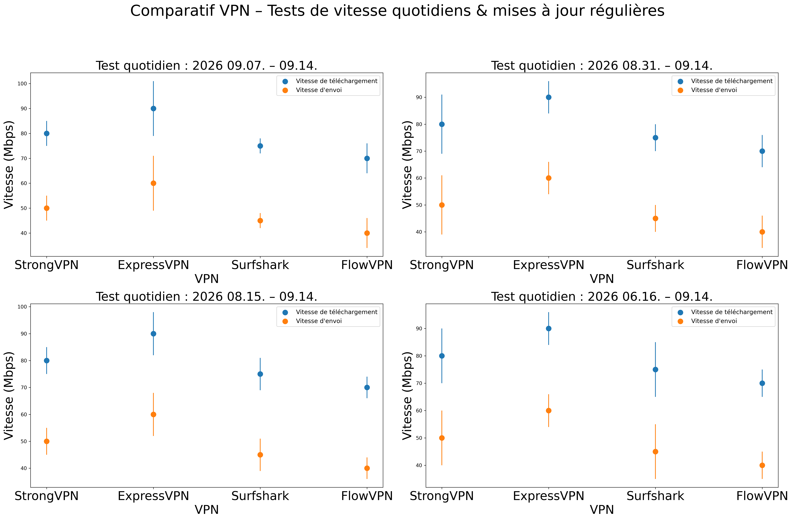

# Regarder la TV française à l'étranger avec un VPN : tests, appareils et erreurs

TF1+, France.tv, M6+, Canal+/myCANAL, Molotov, beIN Sports et RMC Sport n'appliquent pas forcément les mêmes droits ni les mêmes contrôles. Une adresse IP française peut suffire dans un cas et échouer dans un autre à cause du compte, des cookies, de l'appareil ou de la portabilité européenne.

Ce guide propose une méthode de test. Il ne promet pas qu'une plateforme acceptera durablement un serveur VPN.

> **Test rapide :** vérifiez d'abord la portabilité de votre abonnement, connectez-vous ensuite à un serveur français, contrôlez l'IP, ouvrez une fenêtre privée et lancez un vrai direct ou replay pendant 15 minutes.

## Commencer par la règle de la plateforme

| Plateforme | Premier contrôle | Erreur fréquente | Deuxième essai utile |
|---|---|---|---|
| TF1+ | IP, compte, droits du programme | Page visible, vidéo bloquée | Fenêtre privée et autre serveur français |
| France.tv | IP et droits par programme | Certains replays passent, d'autres non | Comparer direct et replay gratuit |
| M6+ | Zone autorisée et cookies | Message territorial | Fermer la session et changer de serveur |
| Canal+ / myCANAL | Abonnement et portabilité UE | Accès différent selon pays et durée | Vérifier les conditions du compte avant le VPN |
| Molotov | Formule payante, pays, appareil | Chaînes différentes à l'étranger | Vérifier l'éligibilité UE et l'offre souscrite |
| beIN / RMC Sport | Compte, droits sportifs et IP | Direct indisponible | Tester hors événement et consulter les conditions |

Lors d'un séjour temporaire dans l'Union européenne, certains abonnements payants peuvent rester accessibles grâce à la portabilité. C'est la première chose à vérifier : utiliser un VPN inutilement peut ajouter une nouvelle source d'erreur.

## Ordre des VPN à tester

| Ordre | VPN | Profil adapté | À vérifier avant de le garder |
|---:|---|---|---|
| 1 | [StrongVPN](https://strongvpn.com/fr/?tr_aid=60d96b5810e50&chan=w_github_fr&data1=fr-home&data2=hero) | Première option payante pour limiter le coût sur un an | Serveur France, plateforme réelle, total, remboursement |
| 2 | [ExpressVPN](https://go.expressvpn.com/c/3828265/1634752/16063) | Option premium pour l'application et l'assistance | Appareil TV, service précis, renouvellement |
| 3 | [Surfshark](https://get.surfshark.net/aff_c?offer_id=323&aff_id=5585&source=w_github&aff_sub=fr) | Famille ou foyer avec beaucoup d'appareils | Engagement long, taxes, connexions simultanées |
| 4 | [FlowVPN](https://www.flowvpx.com/sign-up/?locale=fr&special=FREETRIAL&r=35-890485.w_github) | Vérification courte d'une plateforme | Fin de l'essai, résiliation, serveur français |

Transparence : ces liens peuvent rapporter une commission à VPN Clair, sans surcoût pour vous. La recommandation reste conditionnelle au test de votre plateforme et de votre compte.

## Protocole de test en 20 minutes

1. Notez le message exact sans VPN.
2. Vérifiez si votre abonnement prévoit déjà la portabilité.
3. Connectez-vous à la France et contrôlez IP et DNS.
4. Ouvrez une fenêtre privée sans anciennes extensions de localisation.
5. Testez une émission gratuite, puis votre contenu principal.
6. Comparez direct et replay.
7. Laissez tourner 15 minutes et changez de qualité.
8. Conservez le nom du serveur, l'heure et l'appareil.

## Téléphone, ordinateur et télévision ne réagissent pas pareil

### Navigateur sur ordinateur

C'est le meilleur environnement de diagnostic : les cookies, extensions et sessions sont faciles à isoler. Prouvez d'abord que la route française fonctionne ici.

### iPhone et Android

L'application peut lire la région du store, les permissions de localisation et une ancienne session. Ne changez pas le pays du store sans vérifier les conséquences sur vos abonnements et votre solde.

### Apple TV, Fire TV et Smart TV

Vérifiez la disponibilité des deux applications, VPN et télévision, dans le store lié au compte. Si l'ordinateur fonctionne mais pas la TV, examinez l'app, le DNS et le compte avant de changer de VPN.

## Nos graphiques : une preuve de tendance, pas de déblocage

Le débit aide à distinguer congestion et blocage, mais un serveur rapide peut être refusé par une plateforme. Nous utilisons le graphique quotidien pour suivre les tendances et vous demandons de tester le service exact pendant le remboursement.

[Voir le comparatif, la méthode et les prix en euros](../#tests-de-vitesse-vpn-mis-à-jour-chaque-jour).

## Diagnostic des erreurs

### Une chaîne fonctionne, une autre non

Il peut s'agir de droits différents. Testez plusieurs contenus avant de conclure que le VPN est bloqué.

### L'adresse IP est française mais le message reste

Isolez les cookies, changez de serveur, fermez complètement l'application et vérifiez le DNS. Le compte ou l'appareil peut conserver l'ancien pays.

### Le direct démarre puis coupe

Testez 1080p avant 4K, un autre protocole et une connexion Ethernet. Une coupure en soirée peut venir de la congestion plutôt que du géoblocage.

### Canal+ fonctionne dans l'UE mais pas ailleurs

La portabilité et les droits varient selon le pays et la durée du déplacement. Consultez l'aide officielle liée à votre formule.

## Conclusion

StrongVPN reste le premier test économique, ExpressVPN la voie premium, Surfshark le choix multi-appareils et FlowVPN l'essai court. La bonne décision n'est pas « quel VPN débloque tout », mais « lequel réussit ma chaîne, mon compte, mon appareil et mon réseau avant la fin du remboursement ».

[Retour au comparatif VPN Clair](../)
